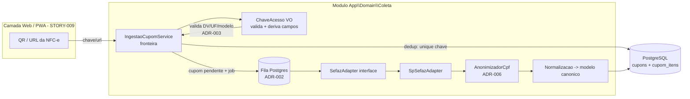

# ADR-001 — Módulo de ingestão de cupom e modelo canônico da NFC-e

## Contexto

O EPIC-002 é o coração do Quantah: transformar o QR Code de uma NFC-e em **dado válido, único e
novo**. A visão (`docs/visao.md` §6) fixa a mecânica: a **chave de acesso de 44 dígitos** e a URL do
QR são a fonte; a extração é **híbrida** (scraping do portal público da SEFAZ-SP no MVP → fonte
oficial depois); e existe um **adaptador por estado** com um **modelo de dados de destino único**. No
MVP só existe o adaptador de SP; a expansão nacional é adicionar adaptadores sem mudar o núcleo
(§6.3).

Falta a decisão estrutural de **como o cupom entra no sistema e como ele é modelado**. Sem ela, as
estórias de implementação (STORY-010 persistência, STORY-011 LGPD, STORY-012 north-star) decidiriam
o modelo de dados sozinhas — proibido pelo processo. Esta ADR é a fundação: define a **fronteira de
ingestão**, a **interface do adaptador** e o **modelo canônico do cupom** (agregados, campos mínimos,
chave natural). As decisões vizinhas — extração resiliente (ADR-002), dedup/validação por chave
(ADR-003) e anonimização de CPF (ADR-006) — penduram nesta.

Restrições que moldam a decisão: stack já ratificada (ADR-000 — Laravel monolito + Postgres); só SP
nesta onda; o valor do produto é o **preço do item** (não quem comprou), o que orienta o modelo a ser
livre de PII (ADR-006). O PDR-002 (escopo da Onda 1) confirma que coleta é o núcleo desta onda.

## Forças (drivers) da decisão

- **F1 — Modelo canônico único, extração plugável por estado (§6.3):** o núcleo não pode saber que
  existe HTML de SEFAZ. Trocar/adicionar estado não pode tocar no modelo canônico.
- **F2 — Chave natural forte:** a chave de acesso de 44 dígitos é única por cupom e é a espinha dorsal
  da dedup (§6.4, ADR-003). O modelo tem de tê-la como identidade natural.
- **F3 — Ingestão assíncrona e idempotente:** o QR é submetido em segundos (fricção mínima, §3.1), mas
  a extração no portal é lenta e frágil (ADR-002). Aceitar rápido, processar depois, sem duplicar.
- **F4 — Livre de PII por design (§7, ADR-006):** o modelo analítico não guarda CPF. A privacidade é
  restrição estrutural, não filtro no fim.
- **F5 — Simplicidade / datastore-first (princípios #1, #3):** um monolito, Postgres como único
  armazenamento; nada de mensageria/serviço extra sem número que prove necessidade.
- **F6 — Coesão alta / acoplamento baixo (#5):** ingestão é um módulo coeso com uma razão de mudar,
  desacoplado da camada web via contrato explícito.

## Opções consideradas

### Opção A — Módulo `Coleta` com adaptador por estado + agregado `Cupom` (chave natural), ingestão assíncrona
- **Resumo:** um módulo de domínio `App\Domain\Coleta` com: (1) uma **fronteira de ingestão**
  (`IngestaoCupomService`) que recebe chave/URL, valida/deduplica só pela chave e enfileira; (2) uma
  **interface de adaptador** (`SefazAdapter`) com implementação por estado (`SpSefazAdapter`);
  (3) um **modelo canônico** `Cupom` (raiz) + `CupomItem` + emitente por CNPJ, com `chave_acesso`
  como chave natural única. A camada web (STORY-009) fala com o módulo só pelo serviço de ingestão.
- **Como atende aos princípios:**
  - ✅ Simplicidade: um módulo, um agregado, um Postgres.
  - ✅ Monolito / datastore-first: fila no próprio Postgres (ADR-002), sem serviço extra.
  - ✅ Coesão/acoplamento: adaptador isola o HTML; núcleo não conhece SEFAZ.
  - ✅ Reversibilidade: adicionar estado = nova classe de adaptador; migrar para fonte oficial = nova
    implementação da mesma interface, modelo canônico intacto.
- **Prós concretos:** expansão nacional sem tocar o núcleo; dedup trivial (unique na chave); modelo
  sem PII; testável (adaptador mockável — princípio #6/#10).
- **Contras concretos:** exige disciplina de fronteira (o web não pode importar Eloquent do cupom
  direto); duas escritas (aceite + normalização pós-extração).

### Opção B — Persistir o HTML/JSON bruto da SEFAZ e normalizar sob demanda (schema-on-read)
- **Resumo:** guardar o retorno bruto do portal e derivar campos quando precisar.
- **Como atende aos princípios:** ⚠️ Simplicidade aparente, complexidade adiada; ❌ acoplamento — todo
  consumidor precisa entender o formato de cada estado; ❌ dedup e agregação B2B ficam caras.
- **Prós:** ingestão inicial trivial; nada se perde do original.
- **Contras:** empurra o problema de normalização para todo consumidor; o modelo canônico (exigência
  da visão) deixa de existir de fato; agregações de preço (o produto) ficam sobre dado não modelado.

### Opção C — Status quo / não decidir agora
- **Consequência:** STORY-009..012 não abrem; cada uma decidiria modelo sozinha, gerando divergência.
- **Custo de adiar:** alto — esta ADR é bloqueante de todo o épico.

> Guardar o **payload bruto** como evidência/auditoria de extração (não como modelo) é compatível com
> a Opção A e é tratado na ADR-002 (snapshot de extração para reprocessamento/debug), sem virar o
> modelo canônico.

## Matriz comparativa

| Critério (força) | Peso | Opção A | Opção B (schema-on-read) | Opção C (status quo) |
|---|---|---|---|---|
| F1 — canônico único + plugável | alto | ✅ adaptador isola, modelo único | ❌ cada consumidor entende cada formato | ❌ |
| F2 — chave natural forte | alto | ✅ unique na chave, dedup trivial | ⚠️ dedup possível mas sobre bruto | ❌ |
| F3 — assíncrono idempotente | alto | ✅ aceite rápido + fila + normalização | ⚠️ | ❌ |
| F4 — livre de PII | alto | ✅ normalização descarta CPF (ADR-006) | ❌ bruto carrega CPF | ❌ |
| F5 — simplicidade/datastore-first | alto | ✅ 1 módulo, 1 Postgres | ⚠️ | — |
| F6 — coesão/acoplamento | médio | ✅ fronteira explícita | ❌ alto acoplamento | ❌ |

## Decisão proposta

> **Optamos pela Opção A.**

Criamos o módulo de domínio **`App\Domain\Coleta`** com três peças: uma **fronteira de ingestão**
(`IngestaoCupomService`), uma **interface de adaptador de extração por estado** (`SefazAdapter`, com
`SpSefazAdapter` no MVP) e um **modelo canônico do cupom** cuja **chave natural é a `chave_acesso` de
44 dígitos**. A ingestão é **assíncrona e idempotente**: a submissão do QR valida/deduplica pela
chave (ADR-003), persiste o cupom em estado `pendente` e enfileira a extração (ADR-002); ao concluir,
o adaptador normaliza o retorno no modelo canônico. A camada web (STORY-009) só conhece o serviço de
ingestão — nunca o Eloquent do cupom.

### Modelo canônico do cupom (a referência para 010/011)

**Agregado `Cupom` (raiz), chave natural `chave_acesso`.** Campos mínimos:

| Campo | Tipo (Postgres) | Origem | Observação |
|---|---|---|---|
| `id` | `uuid` (v7) | app | PK técnica; a chave natural é `chave_acesso` |
| `chave_acesso` | `char(44)` **UNIQUE** | QR/URL | identidade natural; dedup (ADR-003) |
| `uf` | `char(2)` | derivado da chave (cUF) | `35` no MVP; salvaguarda de escopo |
| `ano_mes` | `char(4)` | derivado da chave (AAMM) | partição lógica temporal |
| `cnpj_emitente` | `char(14)` | derivado da chave | emitente; não é PII do consumidor |
| `modelo` | `char(2)` | derivado da chave | `65` = NFC-e |
| `numero` | `bigint` | derivado/portal | nNF |
| `serie` | `int` | derivado/portal | |
| `data_emissao` | `timestamptz` | portal | preenchido na extração |
| `valor_total` | `numeric(12,2)` | portal | base do cashback (0,1%) — EPIC-003 |
| `status` | `text` + CHECK | app | `pendente`\|`extraindo`\|`validado`\|`falha`\|`rejeitado` |
| `origem` | `text` | app | `scan`\|`compartilhado` (§5.1) |
| `extraido_em` | `timestamptz` null | app | quando a normalização concluiu |
| `created_at`/`updated_at` | `timestamptz` | app | |

**Entidade filha `CupomItem`** (1..N por cupom):

| Campo | Tipo | Observação |
|---|---|---|
| `id` | `uuid` | |
| `cupom_id` | `uuid` FK | |
| `sequencia` | `int` | ordem do item no cupom (nItem) |
| `descricao` | `text` | descrição no cupom |
| `codigo_loja` | `text` null | código próprio da loja (cProd) |
| `gtin` | `text` null | código de barras global quando presente (cEAN); base do matching futuro (ADR-004) |
| `quantidade` | `numeric(14,4)` | |
| `unidade` | `text` | uUOM |
| `valor_unitario` | `numeric(14,4)` | |
| `valor_total` | `numeric(12,2)` | |

**Sem CPF em nenhuma tabela** deste agregado (ADR-006). O emitente (CNPJ) é dado de empresa, não do
consumidor. O matching de produtos entre lojas (GTIN/CCG) é ADR-004, **fora desta onda** — por isso
`gtin` e `codigo_loja` são apenas armazenados, não reconciliados aqui.

## Justificativa

A Opção A é a leitura direta da visão (§6.3: "adaptador por estado + modelo de destino único") e
respeita os seis princípios centrais sem exceção. A chave natural resolve dedup (ADR-003) e a
fronteira de ingestão mantém o núcleo desacoplado da fragilidade do scraping (ADR-002). Guardar bruto
como modelo (Opção B) contradiz o requisito de modelo canônico e empurra normalização para todo
consumidor — mais caro justamente onde está o valor (agregação de preço). O trade-off aceito da
Opção A (disciplina de fronteira, duas escritas) é barato e automatizável (teste arquitetural que
proíbe a web de importar o Eloquent do cupom).

## Diagrama

## Consequências

### Positivas (o que ganhamos)
- Modelo canônico único e sem PII; expansão nacional por adaptador; dedup trivial.
- Fronteira testável: núcleo mockável, extração isolável (princípios #6/#10).
- Base pronta para STORY-010 (persistência/validação) e STORY-012 (contar sobre `status`+`chave`).

### Negativas / trade-offs aceitos
- Duas escritas por cupom (aceite `pendente` → normalização). Aceito: é o que dá idempotência e
  fricção mínima.
- Disciplina de fronteira exigida — mitigada por teste arquitetural (plano de verificação).

### Neutras
- `numero`/`serie`/itens só existem após a extração; consultas devem tolerar cupom `pendente`.

### Para o time
- **Impacto em estórias:** destrava STORY-009 (só chama o serviço), STORY-010 (implementa
  normalização/persistência sobre este modelo), STORY-011 (aplica ADR-006 no ponto de normalização),
  STORY-012 (conta sobre `status='validado'` + `chave_acesso`).
- **ADRs relacionados:** ADR-002 (extração/fila), ADR-003 (dedup/validação), ADR-006 (CPF). ADR-004
  (matching GTIN) fica fora da onda.
- **Spike de validação:** sim — o spike vertical desta STORY-008 prova o caminho fim a fim.

## Plano de verificação

- **Como verificar conformidade:** teste arquitetural/inspeção garante que módulos fora de `Coleta`
  não importam os modelos Eloquent `Cupom`/`CupomItem` — só o `IngestaoCupomService` e DTOs. Migração
  cria `cupons` com `UNIQUE(chave_acesso)` e sem coluna de CPF.
- **Sinais de revisão (quando reabrir):** se um segundo estado exigir campos que não cabem no canônico
  (revisar o modelo, não furar o adaptador); se o volume de agregação B2B pedir outro armazenamento
  (ADR próprio, datastore-first).
- **Spike de validação:** STORY-008 (esta) — uma chave de SP percorre parse → extração (adaptador
  fake) → normalização → dedup idempotente, com teste.

---

## Aprovação humana

- **Status final:** ✅ aceita
- **Aprovado por:** Alexandro
- **Data:** 2026-07-02
- **Forma do aceite:** aprovação explícita em sessão de Cowork (papel Arquiteto), lote do spike STORY-008.
- **Condicionantes do aceite:** nenhuma.

---

## Histórico

- 2026-07-02 — criada como `proposed` por Arquiteto (spike STORY-008 do EPIC-002).
- 2026-07-02 — **aceita** por Alexandro → `accepted`.
