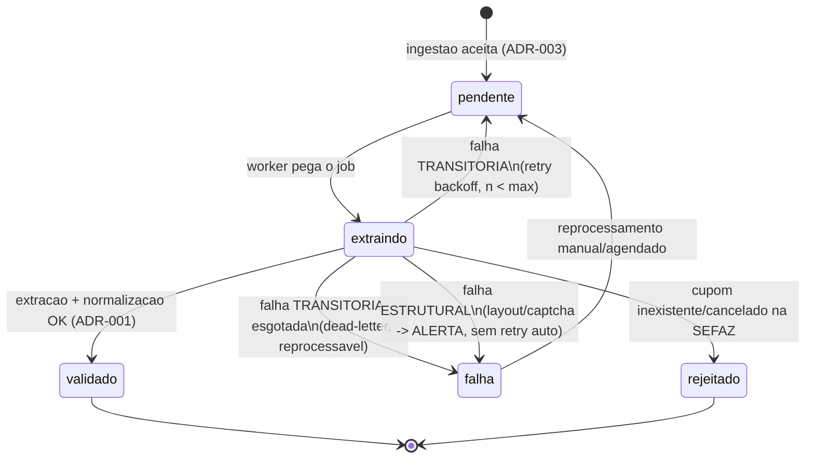

# ADR-002 — Extração resiliente da SEFAZ-SP

## Contexto

A extração dos dados do cupom é o ponto mais frágil do épico. A visão (§6.2) escolhe, para o MVP, o
**scraping do portal público da SEFAZ-SP** — rápido de implementar, sem burocracia, valida a tese —
com **risco reconhecido**: portais mudam de layout e têm proteção anti-bot (captcha, rate limit). A
§6.3 exige **adaptador por estado** e a §14 pede explicitamente "arquitetura de extração resiliente,
fila de reprocessamento, tratamento de captcha, monitoramento de quebra de layout".

Esta ADR decide **como a extração roda de forma resiliente** sem violar os princípios: monolito,
datastore-first (nada de Redis/broker sem número que prove necessidade), 100% local (SEFAZ mockável
em teste), observabilidade como requisito. Ela é a implementação do passo "extração" do fluxo de
ingestão desenhado na ADR-001 e pendura na interface `SefazAdapter` lá definida.

A SEFAZ-SP é um **sistema externo** — vale `integration-architecture.md` (ACL, idempotência, timeout,
graceful degradation) e `security-architecture.md` (HTTPS com validação de certificado; logs sem PII;
nenhuma credencial versionada — o portal é público, mas o padrão vale para a migração futura a fonte
oficial credenciada). O CPF que possa aparecer no retorno é descartado no ponto de normalização
(ADR-006), nunca logado.

## Forças (drivers) da decisão

- **F1 — Fricção mínima na ponta (§3.1):** o usuário recebe "cupom recebido" em segundos; a extração
  lenta/frágil roda **fora do request** HTTP.
- **F2 — Resiliência a falha transitória:** portal fora do ar, rate limit, timeout → **retry com
  backoff** e **reprocessamento**, sem perder o cupom nem duplicar (idempotência via ADR-003).
- **F3 — Quebra de layout / captcha (§6.2):** falha **estrutural** (parser não reconhece o HTML,
  captcha apareceu) é diferente de falha transitória — precisa **parar de tentar** e **alertar**, não
  martelar o portal.
- **F4 — Datastore-first (#3):** fila no Postgres antes de qualquer broker; só troca com número.
- **F5 — 100% local + testável (#6, #10):** extração mockável; o worker roda em `docker compose up`;
  nenhuma chamada real à SEFAZ em teste.
- **F6 — Observabilidade (#8):** taxa de sucesso de extração, fila parada, quebra de layout são
  sinais que **têm** de ser visíveis (cruza com a north-star, STORY-012).
- **F7 — Cidadania na fonte:** não abusar do portal público (rate limit próprio, respeitar o serviço).

## Opções consideradas

### Opção A — Fila no Postgres (queue `database`) + worker + adaptador por estado com política de falha tipada
- **Resumo:** a ingestão enfileira um `ExtrairCupomJob` na **fila `database` do Laravel** (tabela
  `jobs`, `SELECT ... FOR UPDATE SKIP LOCKED`). Um **worker** (`queue:work`, rodando como
  processo/schedule) consome; chama o `SefazAdapter` do estado. O adaptador **classifica a falha**:
  - **transitória** (timeout, 5xx, rate limit) → o job **relança com backoff exponencial** até N
    tentativas; esgotado, vai para `failed_jobs` (dead-letter) e o cupom fica `falha` reprocessável.
  - **estrutural** (parser não bate, captcha detectado) → **não insiste**: marca o cupom `falha`,
    registra o motivo e **dispara alerta** (quebra de layout / bloqueio). Reprocessar só após correção
    do adaptador.
  - **negócio** (cupom inexistente/cancelado na SEFAZ) → cupom `rejeitado`, sem retry.
  Rate limit próprio (throttle) por estado protege o portal (F7). Um **snapshot do retorno bruto**
  (sem PII) é guardado por tentativa para debug/reprocessamento — evidência, não modelo (ADR-001).
- **Como atende aos princípios:**
  - ✅ Datastore-first: a fila é o Postgres; zero serviço extra.
  - ✅ Monolito/local: worker é mais um processo do mesmo app; sobe local no compose.
  - ✅ Reversibilidade: se o volume estourar a fila Postgres (número medido), troca-se o driver da fila
    sem tocar a lógica (contrato de Job do framework).
  - ✅ Observabilidade: fila, tentativas e falhas são linhas em tabela + métricas.
- **Prós concretos:** simples, testável (adaptador fake + `Queue::fake`), idempotente (ADR-003),
  distingue falha que se resolve sozinha de falha que precisa de humano.
- **Contras concretos:** `queue:work` precisa estar rodando (supervisor/schedule) — operacional
  simples, mas real; retry mal calibrado pode martelar o portal (mitigado por backoff + circuit por
  falha estrutural).

### Opção B — Broker dedicado (Redis/SQS) desde já
- **Resumo:** fila em Redis/SQS para "escalar".
- **Como atende aos princípios:** ❌ princípio #3 — adiciona armazenamento/serviço sem número que
  prove que o Postgres não dá conta; ❌ #6 — mais uma peça no local; ⚠️ custo recorrente (#11).
- **Prós:** throughput alto pronto.
- **Contras:** complexidade e custo sem demanda comprovada no MVP (volume de coleta ainda é zero).

### Opção C — Extração síncrona no request
- **Resumo:** extrair na hora do envio.
- **Contras:** viola F1 (usuário espera o portal lento/instável); um captcha trava a UX; não há
  reprocessamento natural. Descartada.

### Opção D — Status quo / não decidir agora
- **Consequência:** STORY-010 decidiria a estratégia de extração sozinha; risco de acoplar web ao
  scraping. Custo de adiar: alto (bloqueia o épico).

## Matriz comparativa

| Critério (força) | Peso | Opção A (Postgres queue) | Opção B (broker) | Opção C (síncrono) |
|---|---|---|---|---|
| F1 — fricção mínima | alto | ✅ fora do request | ✅ | ❌ |
| F2 — retry/reprocesso | alto | ✅ backoff + dead-letter | ✅ | ❌ |
| F3 — layout/captcha | alto | ✅ falha tipada + alerta | ⚠️ igual, mas sem ganho | ❌ |
| F4 — datastore-first | alto | ✅ | ❌ store extra sem número | ✅ |
| F5 — local/testável | alto | ✅ Queue::fake + adapter fake | ⚠️ precisa Redis local | ⚠️ |
| F6 — observabilidade | médio | ✅ tabelas + métricas | ✅ | ❌ |
| F7 — não abusar da fonte | médio | ✅ throttle + circuit | ✅ | ❌ martela na hora |
| Custo (#11) | médio | ✅ zero extra | ❌ recorrente | ✅ |

## Decisão proposta

> **Optamos pela Opção A.**

A extração roda **assíncrona, na fila `database` do Laravel** (Postgres, `FOR UPDATE SKIP LOCKED`),
consumida por um **worker** do próprio monolito. Cada estado tem um **adaptador** (`SpSefazAdapter` no
MVP) atrás da interface `SefazAdapter` (ADR-001), que funciona como **ACL**: converte o retorno do
portal no DTO canônico e **classifica falhas** em transitória (retry com backoff + dead-letter),
estrutural (para, alerta — quebra de layout/captcha) e de negócio (rejeita). Um **rate limit próprio**
por estado protege o portal público. Guardamos um **snapshot do retorno bruto sem PII** por tentativa,
para debug e reprocessamento. Nada de broker dedicado até haver **número** que prove que o Postgres
não aguenta.

### Máquina de estados do cupom durante a extração

## Justificativa

A Opção A entrega resiliência real (retry, dead-letter, reprocessamento) e trata o risco central da
visão — **quebra de layout e captcha** — com uma distinção que importa: falha transitória se resolve
sozinha (retry); falha estrutural **não** (parar e alertar evita martelar o portal e detecta o
problema cedo, alimentando a north-star de STORY-012). Tudo isso no Postgres, sem serviço extra
(princípio #3), local e testável (adaptador fake + `Queue::fake`). O broker (B) resolve um problema de
escala que ainda não existe; o síncrono (C) quebra a fricção mínima. O trade-off aceito — manter um
`queue:work` rodando — é operacional trivial e coberto pela infra (ADR-007) via supervisor/schedule.

## Consequências

### Positivas (o que ganhamos)
- Usuário nunca espera o portal; cupom não se perde; reprocessamento é de primeira classe.
- Detecção de quebra de layout/captcha vira sinal observável, não surpresa em produção.
- Expansão por estado sem tocar o worker (só nova classe de adaptador).

### Negativas / trade-offs aceitos
- Precisa de worker rodando (supervisor/schedule) — operacional simples.
- Scraping continua intrinsecamente frágil; esta ADR **gerencia** a fragilidade, não a elimina (a
  eliminação é a migração à fonte oficial, evolução pós-MVP — mesma interface `SefazAdapter`).

### Neutras
- Latência de "cupom recebido" → "cupom validado" é de segundos a minutos, conforme fila/portal. A UX
  (STORY-009) mostra estado `pendente`/`validado`.

### Para o time
- **Impacto em estórias:** STORY-010 implementa o `ExtrairCupomJob`, o `SpSefazAdapter` real e a
  classificação de falha; STORY-012 lê taxa de sucesso e fila para a north-star.
- **ADRs relacionados:** ADR-001 (interface/fronteira), ADR-003 (idempotência no reprocesso), ADR-006
  (CPF descartado na normalização, nunca logado), ADR-007 (worker no deploy).
- **Spike de validação:** sim — o spike desta STORY-008 exercita o adaptador fake com um caminho de
  **falha de extração** e reprocessamento idempotente.

## Plano de verificação

- **Como verificar conformidade:** testes com adaptador fake cobrem: sucesso, falha transitória
  (retry), falha estrutural (marca `falha` + sinaliza, sem retry automático), reprocesso idempotente.
  Inspeção garante ausência de credencial versionada e que nenhum log carrega CPF (ADR-006).
- **Sinais de revisão (quando reabrir):** taxa de falha estrutural recorrente (layout mudando muito →
  acelerar migração à fonte oficial); volume de fila que o Postgres não sustente (número medido →
  reavaliar driver, ADR próprio); necessidade de captcha-solving (decisão de produto/custo → PO).
- **Spike de validação:** STORY-008 (esta).

---

## Aprovação humana

- **Status final:** ⬜ pendente
- **Aprovado por:** —
- **Data:** —
- **Forma do aceite:** —
- **Condicionantes do aceite:** —

---

## Histórico

- 2026-07-02 — criada como `proposed` por Arquiteto (spike STORY-008 do EPIC-002).
