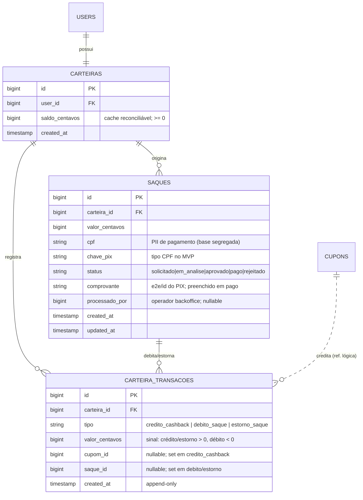
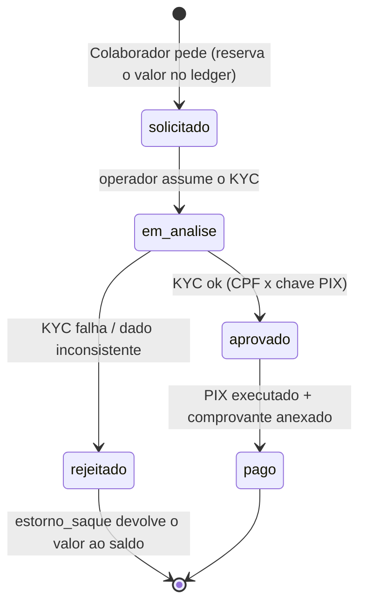

# ADR-005 — Escopo do saque no MVP: PIX assistido, KYC mínimo e modelo da carteira

## Contexto

O EPIC-003 fecha o loop de incentivo: cada cupom válido (EPIC-002) credita **0,1% do valor** como
saldo em reais na carteira do Colaborador, e o épico precisa de um **caminho de resgate** (saque). A
`docs/visao.md` §8.1 é categórica: o cashback é **remuneração direta por serviço prestado** (o usuário
entrega um dado e é pago por isso) — **não é sorteio nem promoção comercial**, e por isso **entra no
MVP sem trava regulatória** (diferente do sorteio, §8.3, que exige autorização SPA/SCPC e fica atrás
de um gate). O §5.1 já marca o resgate com a etiqueta *"[→ Fase técnica: integração de pagamento/PIX,
KYC mínimo para saque]"*, e o §7 exige que o **dado pessoal de pagamento** seja tratado com base legal
apropriada e **segregado da base analítica**.

O que **precisa ser decidido agora** é o **contorno do saque no MVP**: a camada de pagamento (PIX) e a
verificação de identidade (KYC) são o **maior risco de custo e complexidade** desta onda, e a
STORY-017 (resgate) não tem contorno até esta decisão sair. O EPIC-003 já reconhece isso explicitamente
no "Fora de escopo": *"Saque totalmente automatizado com KYC completo, se o ADR-005 indicar que é caro
para a onda: neste caso, entra resgate simplificado (ex.: PIX manual/assistido) e a automação vai para
a Onda 2. O essencial da onda é o crédito de saldo, não o saque automatizado."*

Restrições herdadas que moldam a decisão:

- **ADR-000** — stack ratificada: monolito Laravel + Inertia/React + PostgreSQL. Qualquer integração é
  ACL dentro do monolito; nada de armazenamento extra sem provar que o Postgres não basta (princípio #3).
- **ADR-006** — a **base de pagamento** (carteira/saque, com o mínimo de PII) é **segregada** da base
  analítica (cupons/itens/preços). Esta ADR materializa essa base segregada e nada mais. O CPF do
  **cupom** continua descartado na coleta (ADR-006); o CPF que aparece aqui é **outro dado**, fornecido
  deliberadamente pelo próprio titular para receber o pagamento, com base legal própria.
- **ADR-003** — a dedup por chave de acesso já impede que o **mesmo cupom** pague duas vezes. O risco
  financeiro desta ADR é **outro**: sacar mais do que se ganhou, ou sacar para chave de terceiro.
- **PDR-002** — a Onda 1 existe para **provar a coleta em SP com incentivo**. O volume de saques do
  piloto é **baixo e não comprovado**; pagar por automação de pagamento antes de provar a north-star é
  investir contra o princípio #1 (simplicidade) e #11 (custo).
- **Time pequeno, sem orçamento de unicórnio.** Integração com PSP (habilitação, homologação,
  contrato, webhook, conciliação) tem custo de setup e recorrente reais e um lead time de dias a
  semanas que **não pode ser caminho crítico** do MVP.

Esta ADR **não** implementa integração de pagamento (isso é a STORY-017, no contorno aqui decidido) e
**não** decide o PSP de produção — decide o **escopo do saque**, o **KYC mínimo**, e esboça o **modelo
mínimo da carteira/transações** o suficiente para destravar STORY-015 (crédito) e STORY-016 (tela).

## Forças (drivers) da decisão

- **F1 — O essencial da onda é o crédito visível, não o saque automatizado** (EPIC-003, §8.1): a
  hipótese da north-star se testa com o saldo crescendo a cada cupom; o saque precisa **existir e ser
  crível**, não precisa ser instantâneo/automático.
- **F2 — Custo e lead time da camada de pagamento (#11):** PSP com PIX payout tem setup, custo por
  transação e homologação. Antes de volume comprovado, é gasto e risco sem retorno.
- **F3 — Reversibilidade preferida (#7):** a decisão precisa **manter a porta aberta** para automatizar
  na Onda 2 sem retrabalho — modelo de dados extensível, contrato de saque estável, gatilho explícito.
- **F4 — Integridade financeira e anti-fraude:** saldo nunca fica negativo; não se saca mais do que se
  ganhou; não se saca para chave de terceiro; nenhum saque é pago duas vezes. Conciliação saldo × cupons
  sem divergência (métrica de qualidade do épico).
- **F5 — LGPD por design + segregação de bases (§7, ADR-006):** CPF e chave PIX são PII **de
  pagamento** — vivem na base segregada, com base legal própria (execução de contrato / obrigação
  legal), nunca na base analítica; mínimo necessário, retenção definida.
- **F6 — Funcionamento 100% local (#6):** o fluxo de saque precisa subir e ser exercitado localmente
  sem internet. Saque assistido é trivialmente local (nenhum externo no caminho); automação exigiria
  mock de PSP.
- **F7 — Observabilidade e trilha de auditoria (#8):** cada operação de saque é financeira — precisa de
  **audit log imutável** (quem pediu, quem aprovou/pagou, quando, com que comprovante) e reconciliação.
- **F8 — Testabilidade sem heroísmo (#10):** o núcleo de dinheiro (saldo em centavos, máquina de
  estados do saque, invariante de saldo ≥ 0) precisa ser testável em unidade e E2E. Assistido é uma
  máquina de estados pura; automação acopla teste a webhook/idempotência de terceiro.

## Opções consideradas

### Opção A — PIX **assistido** (solicitação no app + execução manual no backoffice) + KYC mínimo — *recomendada*

- **Resumo:** o Colaborador solicita o saque no app informando **CPF** e **chave PIX**; o sistema
  **reserva o valor** (debita a carteira via lançamento no ledger, deixando o saldo consistente) e cria
  um `saque` em estado `solicitado`. Um operador no **backoffice** faz o **KYC mínimo** (confere que a
  chave PIX pertence ao mesmo CPF — o caminho mais simples é exigir **chave PIX do tipo CPF**), executa
  o **PIX manualmente** pela conta da empresa e marca o saque como `pago`, anexando o **comprovante**
  (id da transação / e2e do PIX). Rejeição devolve o valor (estorno no ledger). **Nenhuma integração de
  PSP**; nenhum externo no caminho crítico.
- **Como atende aos princípios** (`references/architecture-principles.md`):
  - ✅ Simplicidade (#1): uma máquina de estados + uma tela de backoffice; zero integração externa.
  - ✅ Custo (#11): custo marginal do PIX é R$ 0 (PIX PF/PJ gratuito na maioria dos bancos); sem setup de PSP.
  - ✅ Reversibilidade (#7): o `saque` já nasce com contrato e estados que a automação da Onda 2 reusa —
    trocar "operador humano" por "adapter de PSP" não muda o modelo de dados nem o contrato do app.
  - ✅ Local 100% (#6): nada a mockar — o "operador" é uma ação de backoffice.
  - ✅ Testável (#10): saldo em centavos, invariante saldo ≥ 0, transições de estado — tudo unidade + E2E.
- **Prós concretos:** destrava a onda sem lead time de PSP; custo ~zero; anti-fraude por revisão humana
  (gate natural no volume baixo do piloto); LGPD minimalista (só CPF + chave PIX, na base segregada);
  conciliação trivial (ledger append-only).
- **Contras concretos:** operação **manual não escala** — cada saque consome tempo de um operador; há
  latência (não é instantâneo). Mitigação: volume do piloto é baixo por construção; gatilho explícito de
  automação (Opção B) na Onda 2 quando o volume passar da capacidade manual.

### Opção B — PIX **automatizado** via PSP (payout) + KYC completo

- **Resumo:** integrar um PSP que ofereça **PIX payout** por API (ACL dedicada, idempotência, webhook
  entrante de confirmação com HMAC), com KYC mais forte (validação de CPF, possivelmente documento).
  Saque cai na conta do Colaborador sem operador humano.
- **Como atende aos princípios:** ⚠️ Simplicidade: ACL + webhook + idempotência + conciliação
  automática + mock local do PSP são complexidade real; ❌ Custo/lead time: habilitação, contrato,
  homologação e custo recorrente **antes** de provar a north-star; ⚠️ Local 100%: exige mock fiel do PSP.
- **Prós:** escala; saque quase instantâneo; menos trabalho operacional recorrente.
- **Contras:** custo e lead time altos para uma onda cujo objetivo é **provar coleta**, não operar
  pagamentos em escala; superfície de segurança e de teste muito maior; **prematuro** (princípio #1, #11).
  É a evolução natural — na Onda 2, com volume real.

### Opção C — Adiar o saque por completo (só crédito no MVP, sem resgate)

- **Consequência se mantivermos:** o saldo cresce mas **não há caminho para o dinheiro**. O EPIC-003
  exige, no entregável, que *"um caminho de resgate existe"*, e o incentivo perde credibilidade se o
  Colaborador não vê como sacar. Enfraquece exatamente a hipótese que a onda quer testar.
- **Custo de adiar:** baixo em engenharia, **alto em produto** — mina o loop de incentivo. Um caminho
  assistido mínimo (Opção A) custa pouco e preserva a credibilidade. Descartada.

## Matriz comparativa

| Critério (força) | Peso | Opção A (assistido) | Opção B (PSP automatizado) | Opção C (adiar saque) |
|---|---|---|---|---|
| F1 — crédito é o essencial da onda | alto | ✅ saque existe e é crível | ✅ existe (mas > que o necessário) | ❌ saque não existe |
| F2 — custo/lead time da camada PIX | alto | ✅ ~R$ 0, sem setup | ❌ setup + recorrente + homologação | ✅ zero |
| F3 — reversibilidade p/ automatizar | alto | ✅ contrato/modelo reusável na Onda 2 | ✅ já é o destino | ⚠️ nada construído |
| F4 — integridade/anti-fraude | alto | ✅ ledger + invariante + revisão humana | ✅ ledger + regras automáticas | n/a |
| F5 — LGPD/segregação | alto | ✅ mínimo de PII na base segregada | ⚠️ mais PII (KYC completo) | ✅ nada novo |
| F6 — local 100% | médio | ✅ nada a mockar | ⚠️ mock de PSP | ✅ |
| F7 — auditoria | médio | ✅ audit log + comprovante | ✅ audit + webhook | n/a |
| F8 — testável | médio | ✅ máquina de estados pura | ⚠️ acopla webhook/idempotência externa | ✅ |
| Simplicidade (#1) | alto | ✅ | ❌ | ✅ (mas fura o produto) |

## Decisão proposta

> **Optamos pela Opção A — PIX assistido com KYC mínimo**, com a automação via PSP (Opção B) **deferida
> para a Onda 2** sob gatilho explícito.

No MVP, o resgate é **PIX assistido**: o Colaborador solicita o saque no app informando **CPF** e
**chave PIX** (exigindo **chave do tipo CPF** para que a titularidade seja verificável sem serviço
externo); o sistema **reserva o valor** debitando a carteira no ledger e cria um `saque` em
`solicitado`. Um operador no **backoffice** confere o KYC mínimo, executa o PIX **manualmente** pela
conta da empresa e marca `pago` com **comprovante**; rejeição gera **estorno** ao saldo. Não há
integração de PSP nesta onda. O **KYC mínimo** é: CPF do titular + chave PIX do tipo CPF (titularidade
por construção) + consentimento/base legal registrados; **valor mínimo de saque** para evitar micro
transferências operacionalmente caras. A **base de pagamento** (carteira, ledger, saques) é
**segregada** da base analítica (ADR-006) e guarda apenas o mínimo de PII (CPF + chave PIX).

A automação (Opção B) é reconhecida como o **destino** e fica `deferred` **dentro desta ADR** com
gatilho de retomada (ver seção final): quando o volume de saques ultrapassar a capacidade de operação
manual ou a north-star for validada, abre-se ADR de integração de PSP que **reusa** o mesmo contrato de
saque e o mesmo modelo de dados — o adapter de PSP substitui o "operador humano" sem mudar o núcleo.

## Justificativa

A força que decide é F1 cruzada com F2/F11: o objetivo da onda é **provar a coleta com incentivo**, e
para isso o saldo precisa **crescer visivelmente** e ter um **caminho de resgate crível** — não precisa
de pagamento automatizado em escala. Pagar o custo e o lead time de um PSP (Opção B) antes de haver
volume é investir contra os princípios #1 e #11; adiar o saque por completo (Opção C) fura o produto e
mina a hipótese. A Opção A entrega o resgate **hoje**, a custo ~zero, com anti-fraude adequada ao
volume (revisão humana é um gate natural quando os saques são poucos) e — crucialmente — **sem dívida
de reversibilidade** (#7): o contrato de saque e o modelo de carteira/ledger são desenhados para que a
automação da Onda 2 entre como um **adapter**, não como uma reescrita. O trade-off honesto é o **custo
operacional manual** e a **latência** do saque; ambos são toleráveis no piloto e têm gatilho explícito
de superação. LGPD (F5) sai mais forte na Opção A: menos PII, na base já segregada por ADR-006.

## Modelo mínimo da carteira e transações (esboço para STORY-015/016)

> Objetivo: destravar STORY-015 (crédito) e STORY-016 (tela) sem que a implementação decida o modelo
> sozinha. O detalhe fino (nomes de coluna, índices) é do Programador; os **agregados, a invariante e o
> contrato de estados** são desta ADR.

**Princípios do modelo:**

- **Dinheiro em inteiro de centavos** (`bigint`), **nunca** float. Toda a aritmética de saldo é inteira.
- **Ledger append-only é a fonte da verdade do saldo.** O saldo é `SUM(valor_centavos)` das transações
  da carteira. Uma coluna materializada `saldo_centavos` em `carteiras` pode existir como cache,
  **atualizada na mesma transação** que insere o lançamento e **reconciliável** contra o ledger (a
  reconciliação sem divergência é métrica de qualidade do épico). Sem o ledger, saldo e cupons divergem.
- **Invariante:** `saldo_centavos >= 0` sempre. O débito de saque é validado **com lock da carteira**
  (ex.: `SELECT ... FOR UPDATE`) para impedir corrida de saque duplo.
- **Idempotência do crédito:** no máximo **um** lançamento de `credito_cashback` por cupom válido —
  garantido por unicidade em `(carteira_id, cupom_id, tipo)`. Amarra com a dedup por chave (ADR-003):
  cupom único → crédito único.
- **Base segregada (ADR-006):** `carteiras`, `carteira_transacoes` e `saques` são a **base de
  pagamento**; `cupom_id` é apenas uma referência (FK lógica) — nenhum dado de item/preço nem PII do
  cupom cruza para cá, e o CPF/chave PIX de saque **não** cruzam para a base analítica.

**Máquina de estados do saque:**

> Na Onda 2, `em_analise → aprovado → pago` passa a ser conduzido por um **adapter de PSP** (payout +
> webhook de confirmação), sem alterar estados nem contrato. O "operador humano" é o adapter do MVP.

## Threat model leve

- **Adversário:** Colaborador (ou conta comprometida) tentando **sacar mais do que ganhou**, **sacar em
  duplicidade** (corrida), ou **sacar para chave PIX de terceiro**; e o risco de **PII de pagamento
  vazar** para a base analítica ou log.
- **O que quer:** extrair dinheiro indevido; desviar pagamento; ligar consumo a identidade.
- **Como impedimos:** saldo é `SUM(ledger)` com invariante `>= 0` validada **sob lock** no débito
  (impede saque duplo e saldo negativo); crédito único por cupom via unicidade `(carteira_id, cupom_id,
  tipo)` amarrado à dedup por chave (ADR-003); **chave PIX do tipo CPF** + revisão humana no backoffice
  garantem titularidade sem serviço externo; CPF/chave PIX vivem só na **base segregada** (ADR-006),
  mascarados em log; **audit log imutável** de solicitação/aprovação/pagamento com comprovante.
- **Como sabemos se falhou:** job de **reconciliação** (saldo == créditos − saques pagos, sem
  divergência) — sinal de alarme se divergir; audit log de cada transição; alerta no backoffice para
  saque preso em estado por muito tempo.

## Consequências

### Positivas (o que ganhamos)
- Resgate **existe e é crível** na onda, a custo ~zero e sem lead time de PSP — a onda não trava.
- Modelo de carteira/ledger sólido (dinheiro em centavos, ledger append-only, invariante de saldo)
  que **destrava STORY-015/016** e serve de fundação para a automação da Onda 2.
- LGPD mais forte: mínimo de PII de pagamento, na base já segregada por ADR-006.
- Anti-fraude adequada ao volume (revisão humana como gate natural) + conciliação automatizável.

### Negativas / trade-offs aceitos
- **Operação manual do saque não escala** e introduz **latência** (não é instantâneo). Aceito no piloto;
  gatilho explícito de automação na Onda 2.
- Exige uma **tela de backoffice** de operação de saque (esforço na STORY-017) — superfície administrativa
  que precisa de auth forte e audit log (cruza com `security-architecture.md`, segregação de interface).

### Neutras
- O PSP de produção **não** é escolhido nesta ADR — decisão deliberadamente deferida para quando houver
  volume, com contrato de saque já estável para acomodar o adapter.

### Para o time
- **Impacto em estórias:**
  - **STORY-015** (crédito): implementa `carteiras` + `carteira_transacoes` (ledger), o lançamento
    `credito_cashback` idempotente por cupom (0,1%, em centavos) e a reconciliação. **Não depende deste
    spike** para o crédito, mas herda daqui o modelo de carteira/ledger.
  - **STORY-016** (tela): saldo (do cache reconciliável) + histórico (ledger) — mobile.
  - **STORY-017** (resgate): implementa a solicitação de saque (reserva via ledger), a **tela de
    backoffice** de operação (KYC mínimo + marcar pago + comprovante), a máquina de estados e o estorno.
    É a estória **destravada por este spike**.
- **ADRs/PDRs relacionados:** ADR-006 (segregação de bases — esta ADR materializa a base de pagamento);
  ADR-003 (dedup por chave — amarra crédito único por cupom); ADR-000 (monolito + Postgres — ledger no
  primário, princípio #3); ADR-007 (infra — backoffice roda no mesmo monolito/VPS). PDR-002 (escopo da
  onda). Cria demanda para uma futura **ADR de integração de PSP** (Onda 2).
- **Necessidade de spike de validação:** não — a decisão é assistida/manual, sem tecnologia nova a
  validar. O próprio EPIC-003 já é o exercício.

## Plano de verificação

- **Como verificar conformidade:**
  - Testes de unidade do núcleo de dinheiro: aritmética em **centavos inteiros**; invariante
    `saldo >= 0`; débito de saque **falha** se exceder o saldo; crédito **idempotente** por cupom
    (segundo crédito do mesmo cupom não duplica).
  - Teste de **corrida** de saque (duas solicitações concorrentes não podem sacar o mesmo saldo — lock).
  - Teste de **reconciliação**: `SUM(ledger) == saldo_centavos` e `saldo == créditos − saques pagos`.
  - Teste da **máquina de estados** (transições válidas; `rejeitado` gera `estorno_saque`).
  - Verificação de **segregação/LGPD**: CPF e chave PIX não aparecem em nenhuma tabela da base analítica
    nem em log (mascaramento), reusando a régua de regressão de ADR-006.
- **Sinais de revisão (quando reabrir esta decisão):**
  - **Gatilho de automação:** volume de saques/semana ultrapassar a capacidade de operação manual
    (referência inicial: **> ~30 saques/semana** ou tempo de operação virando gargalo), **ou** a
    north-star validada dando sinal verde para investir na camada de pagamento → abrir **ADR de PSP**.
  - Mudança regulatória que eleve a exigência de KYC/PLD para o valor dos saques.
  - Aparecimento de fraude que a revisão humana não pegue → endurecer regras ou antecipar automação.
- **Spike de validação:** não aplicável (sem tecnologia nova).

## Recomendação de adiamento (parcial — aplica-se à automação via PSP, não à decisão principal)

> A **decisão principal está tomada** (`proposed` → aguardando aceite): saque assistido no MVP. O que se
> **adia** é a **automação via PSP** (Opção B).

- **Por que adiar (a automação):** custo e lead time de PSP não se justificam antes de volume comprovado
  (F2, princípios #1/#11); a Opção A entrega o resgate hoje sem fechar a porta da automação (#7).
- **Gatilho de retomada:** volume de saques acima da capacidade manual (~30/semana como referência) ou
  north-star validada → nova **ADR de integração de PSP** que reusa o contrato de saque e o modelo aqui
  definidos (o adapter de PSP substitui o operador humano).
- **O que fazer enquanto isso:** operar o saque assistido pelo backoffice, medindo volume e tempo de
  operação por saque — esses números **são** o critério de decisão da automação.

---

## Aprovação humana

> Esta seção é o registro formal do aceite. Não preencha sozinho — preencha quando o humano aprovar.

- **Status final:** ✅ aceita
- **Aprovado por:** Alexandro
- **Data:** 2026-07-03
- **Forma do aceite:** aprovação explícita em sessão de Cowork (papel Arquiteto), spike STORY-014.
- **Condicionantes do aceite:** nenhuma.

### Em caso de rejeição
- **Motivo:** ...
- **Próximos passos sugeridos:** ...

---

## Histórico

- 2026-07-03 — criada como `proposed` por Arquiteto (spike STORY-014 do EPIC-003).
- 2026-07-03 — **aceita** por Alexandro → `accepted`.
