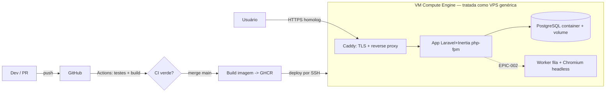

# ADR-007 — Infraestrutura de homologação/produção (VPS genérica no GCP)

> **Gatilho:** STORY-001 (`stories/STORY-001-pipeline-deploy-homolog.md`) exige um ambiente de
> homologação para o deploy automatizado, mas declara explicitamente que **a escolha de provedor
> de infra é ADR do Arquiteto, não decisão da estória** ("se ainda não existir, registrar em Notas
> e escalar ao PO/Arquiteto"). Este ADR fecha essa decisão e destrava a STORY-001.

## Contexto

O EPIC-000 (Foundation) impõe o princípio de **entrega em produção desde o dia 1** → **homologação
no dia 1**. A STORY-001 entrega o "trilho": todo merge roda testes + build e publica automaticamente
uma página viva em homologação. Para isso precisamos de um alvo de deploy que exista e seja
reproduzível.

O produto (visão §12) é um **PWA** (Laravel + Inertia/React + PostgreSQL, ADR-000). No MVP a carga é
modesta: uma app monolítica, um Postgres, e — a partir do EPIC-002 — **filas com browser headless**
para o scraping da SEFAZ-SP (o spike STORY-000 provou que a extração exige um Chromium controlável).
Não há, no horizonte da Onda 1, requisito de escala horizontal, multi-região ou serviços gerenciados.

Restrições e forças de contexto:

- **Decisão do dono (Alexandro):** homologação e produção serão uma **VPS genérica**. Por ora
  usamos o **GCP apenas para levantar a VM** (IaaS), e **todo o resto da infra vive dentro dessa VM**,
  tratada como uma VPS qualquer. Ou seja: **nada de serviços gerenciados do GCP** (Cloud SQL, GKE,
  Cloud Run, Load Balancer, Artifact Registry como dependência dura, etc.).
- **Portabilidade é requisito de primeira classe:** a infra tem de poder migrar do GCP para qualquer
  provedor (Hetzner, DigitalOcean, Contabo, on-prem) trocando só o passo de provisionamento da VM.
- **Custo baixo e previsível** (princípio #11 do Arquiteto): homologação não pode custar como
  produção de unicórnio.
- **100% local reproduzível** (princípio #6): o mesmo artefato que roda em homolog roda na máquina do
  dev via Docker.
- **Time pequeno / operação enxuta:** menos peças móveis = menos operação. Sem Kubernetes.

## Forças (drivers) da decisão

- **F1 — Portabilidade (não-lock-in):** poder trocar de provedor sem reescrever a infra. **Peso: alto.**
- **F2 — Simplicidade operacional:** menos componentes para operar/depurar. **Peso: alto.**
- **F3 — Custo baixo e previsível:** homologação barata; produção escalável por upgrade de VM antes de
  distribuir. **Peso: alto.**
- **F4 — Paridade dev↔homolog↔prod:** mesmo artefato (imagem) nos três. **Peso: médio.**
- **F5 — Compatibilidade com o roadmap:** suportar filas + browser headless do EPIC-002 sem
  re-arquitetar. **Peso: médio.**
- **F6 — Automação total (sem passo manual):** deploy dispara no merge, sem SSH manual (CA-2). **Peso: alto.**

## Opções consideradas

### Opção A — VPS genérica no GCP (Compute Engine), tudo em Docker Compose — *escolhida*
- **Resumo:** uma VM Compute Engine (Ubuntu LTS) tratada como VPS genérica. Dentro dela, **Docker +
  Docker Compose** sobem: reverse proxy com **TLS automático** (Caddy), a app (imagem única
  nginx+php-fpm ou php-fpm atrás do Caddy), **PostgreSQL em container** com volume persistente e, no
  EPIC-002, worker de fila + Chromium. CI (GitHub Actions) builda a imagem, publica no **GHCR** e faz
  **deploy por SSH** (pull + `migrate` + `up -d`). GCP só entra no provisionamento da VM.
- **Como atende aos princípios** (`references/architecture-principles.md`):
  - ✅ Simplicidade: um host, um compose, sem orquestrador.
  - ✅ Reversibilidade/portabilidade: migrar de provedor = recriar 1 VM e apontar o deploy; o compose
    é idêntico.
  - ✅ Custo: uma VM pequena; sem serviços gerenciados cobrando à parte.
  - ✅ 100% local: o mesmo `compose` roda na máquina do dev.
- **Prós concretos:** independência de provedor; paridade de artefato; suporta filas/headless do
  EPIC-002 sem mudar de plataforma; TLS automático sem operação.
- **Contras concretos:** um único host = ponto único de falha (aceitável em homolog; produção mitiga
  com backup + IaC para recriar rápido); operação de VM (patching de SO) é responsabilidade nossa.

### Opção B — Serviços gerenciados do GCP (Cloud Run + Cloud SQL)
- **Resumo:** app em Cloud Run, Postgres em Cloud SQL, TLS/gateway gerenciados.
- **Como atende aos princípios:** ✅ operação reduzida; ❌ **contraria a decisão do dono** (queremos
  VPS genérica, não amarrar no GCP); ⚠️ Cloud Run não hospeda bem worker de fila persistente + browser
  headless (EPIC-002) sem contorções.
- **Prós:** menos operação de SO; escala automática.
- **Contras:** **lock-in** no GCP (fere F1); custo menos previsível; modelo serverless atrita com o
  worker de scraping do EPIC-002; migrar depois é caro.

### Opção C — Kubernetes gerenciado (GKE)
- **Resumo:** cluster GKE, manifests, ingress.
- **Como atende aos princípios:** ❌ Simplicidade (peça enorme para um monolito + 1 banco); ❌ Custo;
  ⚠️ Reversibilidade (K8s é portável, mas o peso operacional não se justifica).
- **Prós:** escala e padrão de mercado.
- **Contras:** overkill absoluto para o MVP; fere princípios #1 e #11; nenhum sinal de escala pede isso.

### Opção D — Status quo / não decidir agora
- **Consequência se mantivermos:** STORY-001 fica `blocked`; sem homologação, o EPIC-000 não fecha e
  bloqueia toda a Onda 1.
- **Custo de adiar:** alto — é o trilho de que todos os épicos dependem.

## Matriz comparativa

| Critério (força) | Peso | A — VPS/Compose (GCP) | B — Cloud Run + Cloud SQL | C — GKE |
|---|---|---|---|---|
| F1 — Portabilidade | alto | ✅ troca provedor recriando 1 VM | ❌ lock-in GCP | ⚠️ portável mas pesado |
| F2 — Simplicidade operacional | alto | ✅ 1 host, 1 compose | ✅ pouca operação, mas 2 serviços gerenciados | ❌ cluster para operar |
| F3 — Custo | alto | ✅ 1 VM pequena | ⚠️ variável, some rápido | ❌ caro |
| F4 — Paridade de artefato | médio | ✅ mesma imagem/compose | ⚠️ difere do local | ⚠️ difere do local |
| F5 — Roadmap (fila+headless EPIC-002) | médio | ✅ natural | ❌ atrito serverless | ✅ suporta |
| F6 — Automação total | alto | ✅ CI→GHCR→SSH | ✅ CI→deploy | ✅ CI→deploy |

## Decisão proposta

> **Optamos pela Opção A — VPS genérica no GCP, com tudo rodando em Docker Compose dentro da VM.**

Homologação (e, ao fim do primeiro épico de valor, produção) rodam numa **VM Compute Engine tratada
como VPS genérica**. O GCP entra **exclusivamente** para provisionar a VM (IaaS): não usamos nenhum
serviço gerenciado do GCP. Dentro da VM, o **Docker Compose** orquestra os serviços: **Caddy** (reverse
proxy + TLS Let's Encrypt automático), a **app** (imagem construída no CI), **PostgreSQL** em container
com volume persistente, e — quando o EPIC-002 abrir — **worker de fila + Chromium headless**. O CI/CD é
**GitHub Actions**: em push/PR roda testes + build (CA-1); no merge à branch principal, builda a imagem,
publica no **GHCR** e faz **deploy por SSH** (pull da imagem, `php artisan migrate --force`,
`docker compose up -d`), sem passo manual (CA-2).

**Parâmetros default do provisionamento** (ajustáveis; registrados aqui para reprodutibilidade):

| Parâmetro | Valor default | Observação |
|---|---|---|
| Provedor (só a VM) | GCP Compute Engine | conta **`alexandro@rhhub.com.br`** (aceite de 2026-07-02) |
| SO | Ubuntu 24.04 LTS | genérico, portável |
| Tipo de máquina | `e2-small` (2 vCPU shared, 2 GB) | homolog; produção sobe para `e2-medium`+ por upgrade |
| Região/zona | `southamerica-east1` (São Paulo) | público BR; troca livre |
| IP | estático (reservado) | para DNS estável |
| Disco | 20 GB pd-balanced | + volume Docker para dados do Postgres |
| Firewall | 22 (SSH), 80, 443 | 22 restrito a chaves/IP de deploy |
| Domínio/TLS | **`*.sslip.io` no IP público** (aceite de 2026-07-02) | Caddy emite Let's Encrypt automático |

## Justificativa

O produto no MVP é um monolito + um banco + (depois) um worker de scraping. Para essa forma, a VPS
única em Docker Compose é a resposta que respeita **todos** os princípios de peso: é a mais simples
que resolve (#1), mantém tudo no datastore primário sem serviços extras (#3), é 100% reproduzível
local (#6) e — crucialmente — é **reversível/portável** (#7): trocar o GCP por qualquer provedor é
recriar uma VM e reapontar o deploy, porque nada da lógica de infra depende do GCP. Isso é exatamente
o que a decisão do dono pede: "usar o GCP só para levantar a VM e tratar como VPS genérica". As opções
gerenciadas (B) e o Kubernetes (C) trocam essa portabilidade e simplicidade por operação reduzida ou
escala que **ainda não temos evidência de precisar** — e a Opção B ainda atrita com o worker headless
que o EPIC-002 já sinalizou. Aceitamos conscientemente o trade-off do **ponto único de falha** em
homologação; para produção, mitigamos com backup automatizado do volume do Postgres e provisionamento
como código (script/IaC versionado) que recria o host em minutos.

## Diagrama

## Consequências

### Positivas (o que ganhamos)
- **Sem lock-in:** a infra é um `docker-compose.prod.yml` + um script de provisionamento; migra de
  provedor trivialmente.
- **Paridade real:** o mesmo artefato (imagem) e o mesmo compose rodam em dev, homolog e prod.
- **Custo baixo e previsível:** uma VM pequena cobre homologação.
- **Roadmap coberto:** filas e Chromium headless do EPIC-002 entram como serviços do mesmo compose.
- **TLS sem operação:** Caddy renova certificados sozinho.

### Negativas / trade-offs aceitos
- **Ponto único de falha** e responsabilidade de patching do SO (aceitável em homolog; mitigado em prod
  por backup + provisionamento como código).
- **Sem escala automática:** escalar = subir o tamanho da VM (vertical) até haver evidência que peça mais.

### Neutras
- Precisamos gerir **segredos de deploy** (chave SSH, credenciais GHCR, `.env` de produção) como secrets
  do GitHub Actions e no host — nunca no repositório.
- O provisionamento da VM fica como **script/documentação versionada** (`app/deploy/` ou `infra/`),
  para reprodutibilidade e portabilidade.

### Para o time
- **Impacto em estórias existentes:** destrava a **STORY-001** (deploy homolog). Não altera STORY-002/003.
- **ADRs/PDRs relacionados:** depende do **ADR-000** (stack); relaciona-se ao **ADR-008** (E2E roda
  contra este ambiente ou equivalente local); o **ADR-002** (EPIC-002) herda daqui o host das filas e
  do Chromium.
- **Necessidade de spike:** não — o padrão VPS+Compose é maduro; a STORY-001 já é a validação prática.

## Plano de verificação

- **Como verificar conformidade:** o repositório contém o `docker-compose.prod.yml`, o `Dockerfile` de
  produção e o script de provisionamento versionados; o deploy é 100% via GitHub Actions (nenhum passo
  manual de SSH na entrega); a URL de homologação responde 200 por HTTPS após um merge verde.
- **Sinais de revisão (quando reabrir):** se surgir requisito real de alta disponibilidade/escala
  horizontal (métrica concreta, não hipótese); se a operação de um único host virar gargalo do time; se
  o custo de VM crescer a ponto de um gerenciado ficar mais barato **com** dado que justifique o lock-in.
- **Spike de validação proposto:** nenhum adicional — a própria STORY-001 exercita o caminho ponta a ponta.

---

## Aprovação humana

- **Status final:** ✅ aceita
- **Aprovado por:** Alexandro
- **Data:** 2026-07-02
- **Forma do aceite:** aprovação explícita em chat (sessão de 2026-07-02)
- **Condicionantes do aceite:** **conta GCP `alexandro@rhhub.com.br`**; **domínio de homolog via
  `sslip.io`** no IP público; parâmetros default da VM (Ubuntu 24.04, `e2-small`, `southamerica-east1`)
  ratificados.

---

## Histórico

- 2026-07-02 — criada como `proposed` por Arquiteto, destravando a STORY-001. Registra a decisão do dono
  (VPS genérica; GCP só levanta a VM) como arquitetura de infra portável baseada em Docker Compose.
- 2026-07-02 — **aceita** por Alexandro: conta `alexandro@rhhub.com.br`, homolog em `sslip.io`, defaults
  de VM ratificados → `accepted`.
