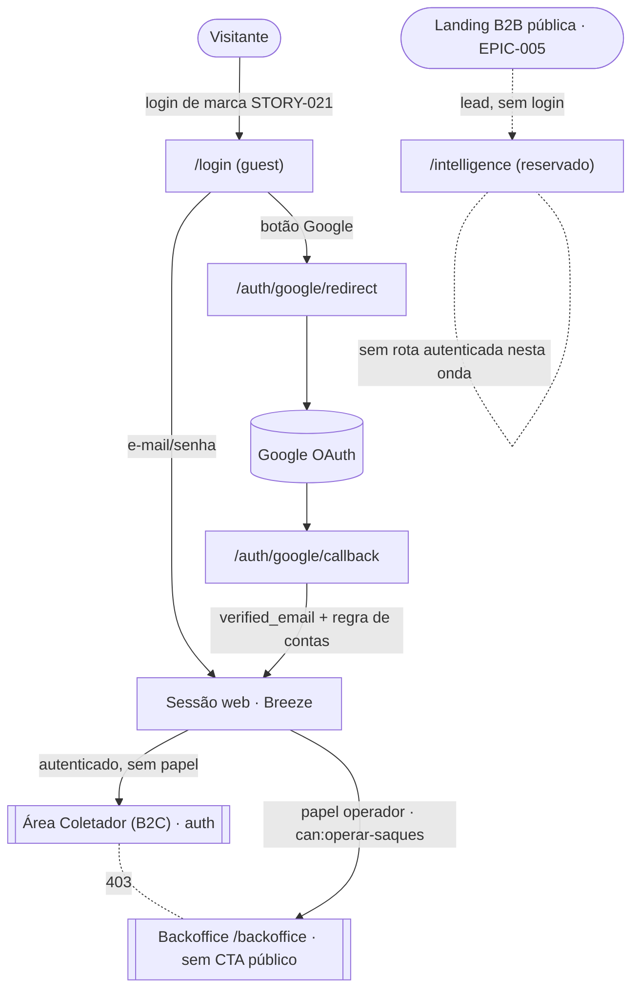

# ADR-010 — Acesso: login Google (OAuth), modelo de contas e segmentação das 3 áreas

## Contexto

O EPIC-004 (`epics/EPIC-004-acesso-e-areas/epic.md`) transforma o acesso do Quantah de "cara de POC"
em produto. Hoje o app roda o scaffolding do **Laravel Breeze** (sessão server-side, e-mail/senha, com o
logo do Laravel) e uma página genérica `/dashboard` pós-login. Não há login social, e os três públicos do
produto — **Coletador (B2C)**, **cliente B2B** e **operação interna (Backoffice)** — compartilham a mesma
porta: qualquer usuário autenticado é tratado como Colaborador, e o Backoffice de saques (STORY-017) já
vive atrás do Gate `operar-saques` no path `/backoffice` (ADR-009).

**PDR-003** (`decisions/pdr/PDR-003-escopo-onda-2-de-poc-a-produto.md`) fixa as decisões de produto que
enquadram este ADR: login B2C por **Google + e-mail/senha**; **B2B sem login** nesta onda (apenas captação
de lead — a área fica *reservada* na arquitetura); **três áreas** — Coletador (B2C, autenticado), Quantah
Intelligence (B2B, público + lead) e Backoffice Operacional (autenticado + RBAC, **sem CTA público**).

Precisamos decidir, antes de implementar (STORY-020..023): (a) como fazer **OAuth Google** (biblioteca e
fluxo); (b) o **modelo de contas** — como Google e e-mail/senha coexistem para o mesmo Coletador, o vínculo
por e-mail e a verificação; (c) a **segmentação das 3 áreas** e suas guardas, reusando/estendendo o RBAC do
ADR-009. O produto lida com dados pessoais e financeiros (ADR-005 saque/KYC; ADR-006 anonimização de CPF),
então a régua de segurança de `references/security-architecture.md` se aplica: fail-secure, menor
privilégio, threat model explícito, segregação da superfície administrativa.

Restrição de time (`_project.md`): time muito pequeno no MVP — soluções que exigem operação pesada são
desqualificadas por padrão. Restrição de infra (ADR-007): uma VPS genérica única em homologação (sslip.io),
sem múltiplos hosts provisionados hoje.

## Forças (drivers) da decisão

- **F1 — Fricção mínima de cadastro (B2C):** o Colaborador Casual é a maioria e precisa entrar em segundos
  (EPIC-004 › outcome). Login Google é o principal redutor de fricção; a solução não pode adicionar passos.
- **F2 — Segurança de conta e do dado financeiro:** a conta do Coletador destrava carteira e saque (ADR-005).
  Vínculo de contas mal feito = risco de account takeover. Fail-secure e threat model explícito são
  obrigatórios (`security-architecture.md`).
- **F3 — Simplicidade e tamanho do time (princípios #1, #4; restrição de time):** reusar o que Laravel/Breeze
  já entregam; nada de infra de identidade pesada nem dependências transversais sem demanda real.
- **F4 — Segregação de superfícies com risco assimétrico (PDR-003; `security-architecture.md` §segregação):**
  comprometer um Coletador atinge uma conta; comprometer o Backoffice atinge todas. As áreas precisam de
  isolamento e o Backoffice não pode ter CTA público.
- **F5 — Extensibilidade sem retrabalho:** a área B2B autenticada e um 2º provedor social (ex.: Apple) são
  plausíveis no futuro (PDR-003 › sinais de revisão). O modelo deve acomodá-los como mudança aditiva, sem
  reescrever o núcleo (princípio #7).
- **F6 — Reuso do RBAC vigente (ADR-009):** já temos `roles`/`role_user`/Gates. A segmentação deve estender
  esse modelo, não criar um segundo sistema de autorização.

## Opções consideradas

Este ADR decide **três eixos**. Em cada um, listo as opções; a matriz consolida.

### Eixo 1 — Biblioteca/fluxo de OAuth Google

- **A1 — Laravel Socialite (driver `google`), fluxo Authorization Code por redirect.** Biblioteca de 1ª
  parte do Laravel, idiomática (`stacks/laravel/SKILL.md` › "Login social → Socialite; só se o produto
  exige"). Servidor troca o `code` por identidade; **não** guardamos tokens de acesso (só usamos identidade
  no login). Sessão server-side existente (Breeze) continua sendo a fonte de autenticação.
  - ✅ Simplicidade (#1) e framework opinativo (#4): zero código de protocolo OAuth à mão.
  - ✅ Segurança: sem armazenar `access_token`/`refresh_token` → superfície de segredo menor.
- **A2 — Cliente OAuth manual / SDK genérico.** Montar o fluxo à mão. Descartada: reinventa o que o Socialite
  entrega, contra #1 e #4.
- **A3 — Passport/OIDC completo.** Overkill: viraríamos um provedor OAuth, sem demanda (`stacks/laravel` reserva
  Passport para "requisito real → ADR"). Descartada.

### Eixo 2 — Modelo de contas (Google ↔ e-mail/senha)

- **B1 — Colunas no `users` (`google_id` nullable+unique, `avatar` nullable) + `password` nullable.**
  Uma conta = uma linha; identidade Google guardada em coluna. Vínculo por **e-mail verificado**. Espelha o
  raciocínio do ADR-009 (YAGNI: não criar tabela extra para um único provedor).
  - ✅ Simplicidade máxima; migração pequena; consultas triviais.
  - ⚠️ Um 2º provedor exigiria migrar para tabela dedicada (mudança aditiva, planejada).
- **B2 — Tabela `social_accounts` (provider, provider_user_id, user_id).** Extensível a N provedores desde já.
  - ✅ Pronta para Apple/etc sem migração.
  - ❌ Antecipa complexidade sem demanda (PDR-003 fixa **só Google** nesta onda; escopo da STORY-019 exclui
    outros provedores). Mesmo anti-padrão que o ADR-009 rejeitou (tabela/pacote para caso único).
- **B3 — Contas separadas por método (sem vínculo).** Google e e-mail/senha viram usuários distintos mesmo com
  o mesmo e-mail. ❌ Quebra F1 (usuário duplicado, carteira fragmentada) e confunde o Coletador. Descartada.

### Eixo 3 — Segmentação das 3 áreas e guardas

- **C1 — Áreas por grupo de rotas + RBAC (ADR-009), host único, sessão única `web`.** Cada área é um grupo de
  rotas com um guard: **B2C** = `auth` (todo autenticado é Coletador); **Backoffice** = `auth` +
  `can:operar-saques` (papel `operador`), sob `/backoffice`, **sem link/CTA público** e com entrada própria
  não anunciada; **B2B** = namespace **reservado** sem rota autenticada (só a landing pública da EPIC-005).
  Redirect pós-login por papel. Fail-secure: rota sem guard explícito nega.
  - ✅ Reusa ADR-009 (F6), simples (#1), roda na infra atual de host único (ADR-007).
  - ⚠️ Segregação por **path**, não por host — `security-architecture.md` classifica path-based como "mais
    fraco" para admin. Mitigável agora; endurecimento por subdomínio fica como decisão adiada com gatilho.
- **C2 — Segregação por subdomínio (`app.` × `admin.`) com cookies/sessões isolados desde já.** É a recomendação
  forte da `security-architecture.md` para a superfície administrativa.
  - ✅ Elimina classes de erro (cookie/CSP/WAF por host); isolamento real.
  - ❌ Exige provisionar 2º host/subdomínio + certificados + 2 guards de sessão — a infra atual (ADR-007, VPS
    única sslip.io) não tem isso, e o Backoffice hoje é **um** recurso (saques). Custo alto para ganho que a
    escala atual não cobra (#1, #11). Melhor **adiar com gatilho**, não fazer agora nem ignorar.
- **C3 — Guards de sessão separados (multi-auth) no mesmo host.** Duas tabelas/guardas de usuário (coletador ×
  operador). ❌ Duplica o modelo de usuário e o RBAC do ADR-009 sem necessidade; operador **é** um `User` com
  papel. Descartada.

## Matriz comparativa

Decisão consolidada por eixo (as opções óbvias já descartadas acima não entram na matriz):

| Critério (força) | Peso | Eixo1: **A1 Socialite** | Eixo2: **B1 colunas** | Eixo2: B2 tabela | Eixo3: **C1 rota+RBAC** | Eixo3: C2 subdomínio |
|---|---|---|---|---|---|---|
| F1 — fricção mínima | alto | ✅ redirect padrão | ✅ conta única | ✅ | ✅ | ✅ |
| F2 — segurança da conta/dado | alto | ✅ sem token guardado | ⚠️ vínculo exige regra explícita | ⚠️ igual | ⚠️ path-based (mitigável) | ✅ isolamento por host |
| F3 — simplicidade/time | alto | ✅ 1ª parte, idiomático | ✅ migração mínima | ❌ tabela p/ caso único | ✅ reusa Breeze/ADR-009 | ❌ 2º host + 2 guards |
| F4 — segregação assimétrica | alto | n/a | n/a | n/a | ⚠️ path + fail-secure | ✅ forte |
| F5 — extensibilidade | médio | ✅ | ⚠️ 2º provedor = migração aditiva | ✅ pronto | ✅ B2B/roles aditivo | ✅ |
| F6 — reuso RBAC (ADR-009) | médio | n/a | n/a | n/a | ✅ estende | ⚠️ tende a 2 sistemas |
| #1/#11 custo/simplicidade | alto | ✅ | ✅ | ⚠️ | ✅ | ❌ |

## Decisão proposta

> **Optamos por A1 + B1 + C1**, com a segregação por subdomínio do Backoffice registrada como **decisão
> adiada (`deferred`)** com gatilho explícito.

1. **OAuth Google via Laravel Socialite** (driver `google`), fluxo Authorization Code por redirect. Rotas:
   `GET /auth/google/redirect` (guest) → `Socialite::driver('google')->redirect()`; `GET /auth/google/callback`
   → resolve identidade, aplica a regra de contas (abaixo), autentica na **sessão `web` existente**. **Não**
   persistimos `access_token`/`refresh_token` — usamos só a identidade no momento do login. `client_id`/
   `client_secret`/`redirect` vêm do `.env` (segredos, `services.google`), nunca no código (ADR-006 §segredos,
   `security-architecture.md` §segredos).

2. **Modelo de contas — colunas no `users`:** adicionar `google_id` (nullable, unique), `avatar` (nullable) e
   tornar `password` **nullable** (conta Google-only não tem senha). Vínculo e verificação (com e-mail do
   Google **verificado** — `verified_email = true`):
   - **Sem usuário com aquele e-mail** → cria conta com `email_verified_at = now()` (o Google já verificou),
     `password = null`, `google_id` preenchido.
   - **Usuário existe e já tem `google_id`** → login.
   - **Usuário existe sem `google_id`** → **vincula** (grava `google_id`) e, se `email_verified_at` estiver
     nulo, marca como verificado (o Google provou a posse do e-mail). Login.
   - Google que **não** retorna e-mail verificado → **recusa** (fail-secure): não cria nem vincula.
   - Um Coletador com senha pode adicionar Google (vínculo) e vice-versa; a **recuperação de senha** (Breeze)
     continua valendo para quem tem senha. Conta Google-only que queira senha usa o fluxo "definir senha"
     (esqueci-senha) — sem tela nova nesta onda além do que o Breeze já oferece.

3. **Segmentação das 3 áreas (host único, sessão `web`, RBAC do ADR-009):**
   - **B2C — Coletador (autenticado):** grupo `auth`. Todo usuário autenticado **sem** papel administrativo é
     Coletador (mantém a premissa do ADR-009: "até aqui todo autenticado era Colaborador"). **Não** criamos um
     papel `coletador` agora (YAGNI); o guard é a presença de sessão. Entrada: login/cadastro de marca
     (STORY-021/022). Redirect pós-login default: área do Coletador.
   - **Backoffice — Operação interna (autenticado + RBAC):** grupo `auth` + `can:operar-saques` sob `/backoffice`
     (já vigente). **Sem CTA público** — nenhuma landing/menu público aponta para lá; a entrada é a URL direta
     (não anunciada). Guarda por **grupo de rota** (um único ponto de `middleware`, nunca `can:` solto por rota
     — evita o anti-padrão "esqueci o middleware em uma rota"). Um Coletador (sem papel) recebe **403** ao
     tentar `/backoffice` (Gate já nega).
   - **B2B — Quantah Intelligence (reservado):** **sem rota autenticada** nesta onda. Reservamos o namespace
     `/intelligence` (área futura); qualquer acesso hoje resolve para a landing pública (EPIC-005) — não há
     login B2B (PDR-003). Papel futuro `analista_b2b` já cabe no RBAC do ADR-009 quando a área ativar.
   - **Isolamento e fail-secure:** cada área é um grupo de rota com guard explícito; rota nova nasce dentro de um
     grupo (default nega). O redirect pós-login é por papel, e o Backoffice nunca aparece na navegação do B2C.

4. **Segregação por subdomínio do Backoffice — `deferred`** (ver "Recomendação de adiamento"): mantemos
   path-based agora; o endurecimento (subdomínio `admin.`, cookie/sessão isolada, MFA no operador, allowlist de
   e-mail/IP) é reaberto pelo gatilho abaixo.

## Justificativa

A combinação vence porque respeita a **assimetria do problema**: o lado B2C exige **fricção mínima** (F1) —
resolvida por Socialite + conta única com vínculo por e-mail — enquanto o lado administrativo exige
**segregação** (F4), hoje entregue por RBAC + grupo de rota fail-secure e amanhã por subdomínio quando o custo
se justificar. Cada eixo escolhe a opção **mais simples que resolve o problema atual** (#1) e **reusa** o que já
existe (Breeze/sessão, ADR-009/RBAC) em vez de introduzir infra de identidade ou um segundo sistema de
autorização (F3, F6). O modelo de contas por colunas espelha, deliberadamente, o precedente do ADR-009 (rejeitar
tabela/pacote para um caso único) — e deixa o caminho aditivo para um 2º provedor (F5) documentado, sem pagar por
ele agora.

O trade-off honesto é a **segregação por path** do Backoffice (F2/F4): `security-architecture.md` a considera
mais fraca que por host. Mitigamos com guard por grupo (não por rota), fail-secure e ausência de CTA público —
e, crucialmente, **não fingimos que está resolvido**: registramos a segregação por subdomínio como `deferred`
com gatilho concreto. Isso é preferível a (a) ignorar a recomendação ou (b) provisionar 2 hosts + 2 guards de
sessão para um Backoffice que hoje é um único recurso (saques), o que a escala atual não cobra (#1, #11).

## Threat model (leve)

- **Adversário / objetivo:** oportunista tentando **account takeover** do Coletador (acessar carteira/saque) ou
  **escalar privilégio** para o Backoffice.
- **Vetores e mitigação:**
  - *Pre-hijacking por vínculo de e-mail* — atacante registra e-mail/senha com o e-mail da vítima e depois a
    vítima entra por Google. Mitigação: o cadastro e-mail/senha (Breeze) **exige verificação de e-mail**, e o
    vínculo por Google só ocorre com **e-mail verificado pelo Google** (posse provada). O Google é autoridade
    sobre o e-mail; recusamos callback sem `verified_email`. Risco residual: janela entre registro não
    verificado e verificação — pequena e coberta pela verificação obrigatória; **auditável** (audit log de
    login/vínculo).
  - *Callback forjado / CSRF no OAuth* — Socialite usa `state`/PKCE do fluxo padrão; callback exige a sessão.
  - *Coletador acessando Backoffice* — Gate `operar-saques` nega (403); guarda por grupo de rota, fail-secure.
  - *Token de terceiro vazando* — não guardamos tokens do Google; só identidade no login.
- **Como sabemos se teve sucesso:** login (Google/senha), falha de login, criação e **vínculo** de conta e
  atribuição de papel viram **audit log** (`security-architecture.md` §audit; alinhado a ADR-009 audit-friendly).

## Classificação de dados tocada

- `email`, `name`, `avatar`, `google_id` → **Pessoal (LGPD)**: acesso autenticado, mascaramento em log, sem
  expor em API além do dono. `password` (hash) → **Credencial**: nunca em log/retorno (já `#[Hidden]`).
  Sem dados sensíveis novos. CPF/financeiro seguem ADR-006/ADR-005 (fora deste ADR).

## Diagrama

## Consequências

### Positivas (o que ganhamos)
- Cadastro/login de baixa fricção (Google) + e-mail/senha, com **conta única** por Coletador.
- Reuso total do RBAC (ADR-009) e da sessão Breeze — sem dependência de identidade nova; migração de schema
  pequena (`google_id`, `avatar`, `password` nullable).
- Três áreas com guardas explícitas e Backoffice sem CTA público; fail-secure por grupo de rota.
- Superfície de segredo reduzida (sem tokens do Google persistidos).

### Negativas / trade-offs aceitos
- Segregação do Backoffice por **path**, não por host (mais fraca) — mitigada e com endurecimento `deferred`.
- Um 2º provedor social exigirá migrar de colunas para tabela `social_accounts` (mudança aditiva planejada).
- Contas **Google-only** não têm senha até o usuário definir uma (fluxo esqueci-senha) — aceitável no MVP.

### Neutras
- `password` passa a ser nullable — exige checagem de `hasPassword()` antes de operações que assumem senha
  (ex.: "confirmar senha" do Breeze); é ajuste local do Programador.

### Para o time
- **Impacto em estórias:** destrava STORY-020..023 (contorno na STORY-019 › Notas do agente). STORY-022
  materializa Socialite + regra de contas; STORY-023 materializa os grupos de área e o namespace B2B reservado.
- **ADRs/PDRs relacionados:** estende **ADR-009** (papéis/Gate); respeita **PDR-003** (Google+senha, B2B sem
  login, 3 áreas); alinhado a **ADR-005/ADR-006** (dado financeiro/PII) e **ADR-007** (host único hoje).
- **Necessidade de spike de validação:** não — decisão apoiada em biblioteca de 1ª parte e padrões vigentes.

## Plano de verificação

- **Conformidade:** E2E (Dusk, ADR-008) cobrindo login Google **simulado**, login e-mail/senha, e **barreira de
  área** (Coletador → 403 no `/backoffice`). Teste arquitetural/inspeção: rota de área nasce dentro de um grupo
  com guard (nenhuma rota `/backoffice` fora do grupo `can:operar-saques`). Nenhum `access_token` do Google
  persistido.
- **Sinais de revisão (reabrir):** ver gatilho de `deferred` abaixo; surgir 2º provedor social; a área B2B
  autenticada entrar em escopo; incidente de account takeover.

## Recomendação de adiamento (segregação por subdomínio do Backoffice — `deferred`)

- **Por que adiar:** hoje o Backoffice é um único recurso (saques) numa VPS de host único (ADR-007). Provisionar
  subdomínio `admin.` + cookies/sessão isolados + MFA + allowlist tem custo de infra e operação que a escala
  atual não cobra (#1, #11). A mitigação path-based (RBAC + grupo + fail-secure + sem CTA) é suficiente para o
  piloto.
- **Gatilho de retomada (qualquer um):** (a) antes do **go-live de produção** com operações financeiras reais;
  (b) o Backoffice passar de saques para **≥2 domínios** de operação (ex.: disputas, gestão de usuários);
  (c) a **área B2B autenticada** entrar em escopo (PDR-003 › sinal); (d) qualquer incidente de segurança na
  superfície administrativa. Ao disparar: ADR próprio de segregação (subdomínio, sessão/cookie isolado, MFA no
  `operador`, allowlist), possivelmente `supersedes` deste no eixo 3.
- **No meio-tempo:** manter Backoffice sob `/backoffice` + Gate por grupo, sem CTA público, e todo acesso
  administrativo em audit log.

---

## Aprovação humana

- **Status final:** ⬜ pendente | ✅ aceita | ❌ rejeitada | 🔄 superseded
- **Aprovado por:** <Alexandro>
- **Data:** YYYY-MM-DD
- **Forma do aceite:** <chat / PR>
- **Condicionantes do aceite:** <se houver>

---

## Histórico

- 2026-07-04 — criada como `proposed` por Arquiteto (STORY-019, spike de arquitetura de acesso do EPIC-004).
