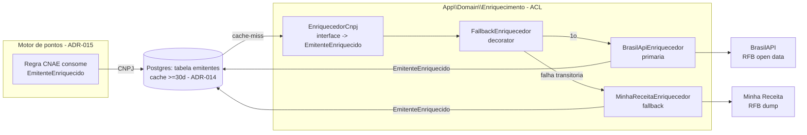

# ADR-012 — Fonte de dados CNPJ (API pública da RFB)

> Tipo: **Integração**. Herda o checklist de `references/integration-architecture.md` (ACL, mock local,
> graceful degradation, custo, monitoramento). Evidência de prova ao vivo (CA-2) em
> `epics/EPIC-009-.../spike-evidencia/prova-api-cnpj.md`.

## Contexto

O PDR-004 (regra 1–2) troca o rate fixo por pontos, e a **primeira dimensão** do cálculo é a categoria
do estabelecimento emitente — o **CNAE**. O cupom canônico (ADR-001) já carrega `cnpj_emitente`
(derivado da chave de acesso), mas não sabe o que o CNPJ **é**: supermercado, farmácia, posto. O
EPIC-009 exige obter razão social, CNAE principal (código + descrição), situação cadastral e
município/UF de uma **API pública e gratuita** de dados da RFB, de forma **assíncrona** (fila, ADR-013)
e **cacheada ≥30d** (ADR-014), **sem nunca bloquear ou atrasar o envio do cupom** ao Colaborador.

O emitente é uma **empresa** — o dado cadastral do CNPJ é público e **não é PII do consumidor**
(ADR-006 segue valendo para o CPF, que continua descartado na normalização). Esta é uma **integração
externa** e, como a SEFAZ (ADR-002), precisa de ACL, tratamento de falha tipado e mock local. O épico
proíbe explicitamente fonte paga ou raspagem do site da RFB.

Esta ADR decide **de onde** vem o dado e **como** o encapsulamos. As decisões vizinhas penduram nesta:
como roda em fila (ADR-013), onde o resultado é cacheado/persistido (ADR-014) e quem o consome (motor
de pontos, ADR-015).

## Forças (drivers) da decisão

- **F1 — Gratuidade real + rate limit compatível:** consumo assíncrono, poucos CNPJs novos por dia
  (base nascente), cacheados ≥30d. O limite precisa comportar isso sem custo. **Peso: alto.**
- **F2 — Campos exigidos completos:** razão social, CNAE principal (código+descrição), situação
  cadastral, município/UF. Sem esses campos a fonte não serve. **Peso: alto.**
- **F3 — Nunca travar o cupom (CA-4):** API fora, CNPJ sem CNAE, rate limit atingido — nenhum pode
  travar cupom nem deixá-lo sem pontuação definitiva. Exige fallback e degradação graciosa. **Peso: alto.**
- **F4 — Troca de fonte barata (ACL, princípio #5/#7):** a fonte pública pode instabilizar ou mudar; o
  domínio fala o **nosso** vocabulário, e trocar de provedor é reescrever um adapter. **Peso: alto.**
- **F5 — 100% local e testável (#6/#10):** dev/CI nunca batem na API real; a ACL é mockável. **Peso: alto.**
- **F6 — Custo zero e sem lock-in (#11):** nenhuma dependência paga; caminho de saída (self-host)
  documentado. **Peso: médio.**
- **F7 — Cidadania na fonte:** respeitar rate limit do provedor público (fila + cache já minimizam
  chamadas). **Peso: médio.**

## Opções consideradas

### Opção A — BrasilAPI como primária + cadeia de fallback, tudo atrás de uma ACL `EnriquecedorCnpj`
- **Resumo:** uma **porta** `App\Domain\Enriquecimento\EnriquecedorCnpj` (interface) que recebe um CNPJ
  e devolve um DTO canônico `EmitenteEnriquecido` (ou "não encontrado"). A implementação primária é um
  `BrasilApiEnriquecedor` (`GET brasilapi.com.br/api/cnpj/v1/{cnpj}`); um **decorator de fallback**
  encadeia uma segunda fonte (Minha Receita — `minhareceita.org/{cnpj}`) quando a primária falha de
  forma transitória. A ACL **classifica falhas** (transitória / negócio / estrutural) igual ao padrão
  SEFAZ (ADR-002) e traduz o shape de cada provedor para o DTO canônico. Self-host da Minha Receita
  fica documentado como **evolução** (elimina a dependência externa — princípios #3/#6), sem custo agora.
- **Como atende aos princípios:**
  - ✅ Simplicidade: uma porta, um adapter primário, um fallback; zero infra nova.
  - ✅ Reversibilidade: trocar/adicionar fonte = novo adapter atrás da mesma porta.
  - ✅ Datastore-first: o resultado é persistido/cacheado no Postgres (ADR-014); a API só é tocada em
    cache-miss.
  - ✅ 100% local: em teste/dev a porta é fake; nunca há rede.
  - ✅ Custo: R$0; sem lock-in (o DTO é nosso; a saída self-host está mapeada).
- **Prós concretos:** BrasilAPI **provada ao vivo** (200, ~0,1–0,5s, todos os campos + `cnaes_secundarios`,
  rajada de 8 sem throttle — ver evidência); fallback aumenta disponibilidade sem custo; ACL isola a
  fragilidade do externo do motor de pontos.
- **Contras concretos:** duas fontes para manter fiéis ao contrato; BrasilAPI/Minha Receita bebem do
  mesmo dump da RFB (fallback correlacionado a falhas de dado, não de disponibilidade) — mitigado por
  ReceitaWS/CNPJá como terceira opção esporádica e pela regra de negócio "cupom não trava" (F3).

### Opção B — ReceitaWS como primária
- **Resumo:** usar `receitaws.com.br` no plano gratuito como fonte principal.
- **Como atende aos princípios:** ⚠️ funciona, mas o rate limit gratuito **mata** o uso como primária.
- **Prós:** shape estável, campos completos.
- **Contras:** **429 a partir da 3ª chamada/minuto** (medido — ver evidência). Inviável para picos de
  coleta (reprocesso, backfill, rajada de cupons novos). Serve só como fallback esporádico.

### Opção C — Self-host da Minha Receita agora (dump completo da RFB no nosso ambiente)
- **Resumo:** subir a Minha Receita (open source) carregando o dump mensal da RFB (~5 GB comprimido,
  dezenas de milhões de linhas) num store nosso, consultado localmente.
- **Como atende aos princípios:** ✅ elimina dependência externa (#6) e é datastore-first radical (#3);
  ❌ **complexidade e custo operacionais reais** (ETL mensal do dump, storage, um serviço a operar) para
  um volume que hoje é ~2 CNPJs distintos — viola princípio #1 (complexidade imaginada).
- **Prós:** zero rede externa, latência local, privacidade total.
- **Contras:** overkill para a fase; time pequeno não deve operar ETL de dump agora. **Fica como
  evolução com gatilho explícito** (ver Plano de verificação).

### Opção D — Status quo / não decidir agora (ou raspar o site da RFB)
- **Consequência:** EPIC-009 não abre; o motor de pontos (EPIC-010) nasce cego. Raspagem do site da
  RFB é **proibida pelo épico** (termos de uso + captcha) e repetiria a fragilidade da ADR-002 sem ganho.
- **Custo de adiar:** alto — bloqueia toda a onda.

## Matriz comparativa

| Critério (força) | Peso | A (BrasilAPI + fallback/ACL) | B (ReceitaWS) | C (self-host já) | D (status quo) |
|---|---|---|---|---|---|
| F1 — gratuidade + rate limit | alto | ✅ rajada 8×200, sem throttle | ❌ 429 em 3/min | ✅ sem limite | ❌ |
| F2 — campos completos | alto | ✅ todos + secundários | ✅ | ✅ | ❌ |
| F3 — nunca travar (fallback) | alto | ✅ cadeia + regra de negócio | ⚠️ fonte única | ⚠️ fonte única | ❌ |
| F4 — troca barata (ACL) | alto | ✅ porta + adapters | ⚠️ sem ACL vaza | ✅ | ❌ |
| F5 — local/testável | alto | ✅ porta fake | ✅ | ⚠️ precisa dump local | — |
| F6 — custo/sem lock-in | médio | ✅ R$0, saída mapeada | ✅ R$0 | ⚠️ storage+ETL | — |
| F7 — cidadania na fonte | médio | ✅ fila+cache minimizam | ⚠️ limite força cuidado | ✅ | ❌ |

## Decisão proposta

> **Optamos pela Opção A.**

Criamos o contexto **`App\Domain\Enriquecimento`** com a porta **`EnriquecedorCnpj`** — uma **ACL** que
recebe um CNPJ e devolve o DTO canônico **`EmitenteEnriquecido`**. A implementação primária é
**BrasilAPI** (`GET /api/cnpj/v1/{cnpj}`); um **decorator de fallback** encadeia a **Minha Receita**
em falha transitória. A ACL classifica falhas em **transitória** (retry/troca de fonte na fila —
ADR-013), **negócio** (CNPJ inexistente/baixado/sem CNAE — cupom **não trava**, pontua sem o componente
CNAE) e **estrutural** (contrato mudou — alerta, sem retry automático). O resultado é
persistido/cacheado no Postgres (ADR-014). **Nenhuma fonte paga; nenhuma raspagem do site da RFB.** O
**self-host da Minha Receita** fica registrado como evolução, com gatilho.

### Comportamento de fallback (CA-4) — nenhum caminho trava o cupom

| Situação | Classificação | Comportamento |
|---|---|---|
| API primária fora / timeout / 5xx | transitória | fallback para 2ª fonte; se ambas falham, **job re-enfileira com backoff** (ADR-013); cupom segue pontuável (pontua sem CNAE após N tentativas, marcando emitente `nao_enriquecido`) |
| Rate limit (`429`) | transitória | troca de fonte + backoff; nunca martela (F7) |
| CNPJ não encontrado / baixado / sem CNAE | negócio | emitente marcado `sem_cnae`/`nao_encontrado`; **cupom pontua pelas demais regras** (valor, itens únicos, bônus — ADR-015); sem retry |
| Resposta em formato inesperado (contrato mudou) | estrutural | **alerta** de quebra de contrato; sem retry automático; cupom pontua sem CNAE (não trava) |

> **Invariante de produto (PDR-004):** creditar pontos **nunca** bloqueia o envio do cupom, e nenhum
> cupom fica **sem pontuação definitiva**. Enriquecimento é um **enriquecedor**, não um gate.

### Contrato da integração (esquema)

**Request primária:** `GET https://brasilapi.com.br/api/cnpj/v1/{cnpj14}` — sem auth, sem body.

**Mapeamento response → `EmitenteEnriquecido` (DTO canônico):**

| Campo canônico | BrasilAPI | Minha Receita | CNPJá (open) | ReceitaWS |
|---|---|---|---|---|
| `cnpj` | `cnpj` | `cnpj` | `taxId` | `cnpj` |
| `razao_social` | `razao_social` | `razao_social` | `company.name` | `nome` |
| `nome_fantasia` | `nome_fantasia` | `nome_fantasia` | `alias` | `fantasia` |
| `cnae_principal_codigo` | `cnae_fiscal` | `cnae_fiscal` | `mainActivity.id` | `atividade_principal[0].code` |
| `cnae_principal_descricao` | `cnae_fiscal_descricao` | `cnae_fiscal_descricao` | `mainActivity.text` | `atividade_principal[0].text` |
| `cnaes_secundarios[]` | `cnaes_secundarios` | `cnaes_secundarios` | `sideActivities` | `atividades_secundarias` |
| `situacao_cadastral` | `descricao_situacao_cadastral` | idem | `status.text` | `situacao` |
| `municipio` | `municipio` | `municipio` | `address.city` | `municipio` |
| `uf` | `uf` | `uf` | `address.state` | `uf` |

Campos extras do provedor são **ignorados** (não falham). O DTO canônico é o único contrato que o
domínio (ADR-015) conhece — nenhum consumidor toca o shape cru do provedor.

## Justificativa

A Opção A é a leitura direta de `integration-architecture.md`: ACL que encapsula o externo, DTO
canônico, falha tipada, mock local. A escolha da **BrasilAPI como primária** não é opinião — é
**provada ao vivo** (CA-2): 3 CNPJs reais (2 emitentes de cupons de homologação + 1 emissor NFC-e real
de SP), 200 OK em todas as fontes, todos os campos exigidos presentes, latência ~0,1–0,5s, e rate limit
generoso (rajada de 8 sem throttle) — enquanto a ReceitaWS bate 429 em 3/min. O fallback para Minha
Receita cobre indisponibilidade sem custo, e a regra de negócio "cupom não trava" (F3) fecha o risco de
o dado simplesmente não existir. Self-host (C) resolve um problema de escala/independência que ainda não
temos — princípio #1 manda adiar, com gatilho.

## Diagrama

## Consequências

### Positivas (o que ganhamos)
- CNAE disponível para o motor de pontos, de graça, com fonte provada e latência baixa.
- Fragilidade do externo isolada numa ACL; trocar de fonte = um adapter novo.
- Fallback + regra "cupom não trava" tornam o enriquecimento **best-effort resiliente**.
- Caminho de independência total (self-host) mapeado, sem pagá-lo antes da hora.

### Negativas / trade-offs aceitos
- Duas fontes públicas para manter fiéis ao contrato (mitigado por contract test noturno opcional).
- Fontes bebem do mesmo dump da RFB → fallback cobre disponibilidade, não divergência de dado (aceito:
  o dado da RFB é o mesmo em qualquer fonte; divergência real é rara e cai na regra de negócio).

### Neutras
- Emitente sem CNAE definitivo existe transitoriamente (`nao_enriquecido`) até o refresh — a UI e o
  motor toleram (pontua sem CNAE; re-pontuação não é exigida — decisão de produto se um dia for).

### Para o time
- **Impacto em estórias:** destrava STORY-040 (consulta assíncrona + cache) e STORY-041 (emitente no
  pipeline e Backoffice).
- **ADRs relacionados:** ADR-013 (roda em fila), ADR-014 (onde o resultado vive/cacheia), ADR-015
  (motor consome o DTO), ADR-002 (mesmo padrão de falha tipada), ADR-006 (CPF segue descartado).
- **Necessidade de spike de validação:** não — a fonte já foi **provada ao vivo** neste spike (CA-2).

## Plano de verificação

- **Como verificar conformidade:** testes usam um `EnriquecedorCnpj` **fake** (princípio #6 — sem
  rede); um teste de mapeamento cobre response real (fixture) → DTO canônico por provedor; inspeção
  garante que só a ACL conhece o shape do provedor. Um **contract test noturno opcional** (CI) bate na
  fonte real com um CNPJ conhecido e alerta se o contrato mudou.
- **Sinais de revisão (quando reabrir):**
  - Taxa de erro/indisponibilidade das fontes públicas atrasando pontuação **> 24h** de forma recorrente
    (sinal do próprio PDR-004) → **acionar self-host da Minha Receita** (Opção C).
  - Volume de CNPJs novos/dia crescer a ponto de esbarrar em rate limit mesmo com cache → self-host.
  - Provedor primário mudar contrato/instituir cobrança → promover fallback a primário (um adapter).
- **Spike de validação:** dispensado (prova ao vivo já feita).

---

## Aprovação humana

- **Status final:** ⬜ pendente | ✅ aceita | ❌ rejeitada | 🔄 superseded
- **Aprovado por:** <Alexandro>
- **Data:** —
- **Forma do aceite:** —
- **Condicionantes do aceite:** —

---

## Histórico

- 2026-07-06 — criada como `proposed` por Arquiteto (spike STORY-039 do EPIC-009), com prova ao vivo (CA-2).
