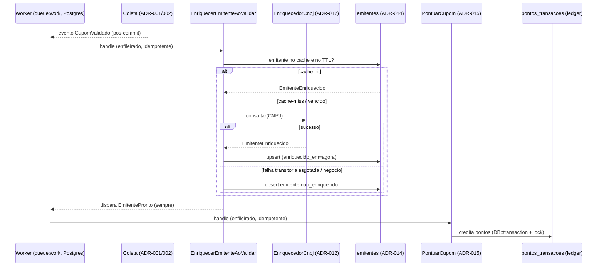

# ADR-013 — Filas e processamento assíncrono (enriquecimento + pontuação)

> Tipo: **Topológico**. Diagrama obrigatório. Reusa a fila `database` (Postgres) e o padrão
> **evento de domínio + listener enfileirado** já vigentes (ADR-002, IDR-008).

## Contexto

O PDR-004 (regra 2) exige que **a consulta ao CNPJ e o cálculo de pontos rodem em fila** e que
**creditar pontos nunca bloqueie o envio do cupom**. O pipeline atual já é assíncrono: a captura aceita
o cupom (`pendente`) e enfileira `ExtrairCupomJob` (ADR-002, fila `database` no Postgres,
`SELECT … SKIP LOCKED`, `tries=3`, backoff `[10,60,300]`); ao validar, dispara o evento de domínio
`CupomValidado`, consumido pelo listener **enfileirado** `CreditarCashbackAoValidar` (IDR-008), que
credita o cashback de forma idempotente.

A Onda 3 acrescenta **dois passos assíncronos** nesse fluxo: (1) **enriquecer o emitente** (consultar o
CNPJ via ACL — ADR-012 — e persistir/cachear — ADR-014); (2) **pontuar o cupom** (motor de regras —
ADR-015 — gravando no ledger de pontos). Ambos rodam fora do request, com retry, idempotência e
observabilidade. O cashback fixo é substituído por pontos (PDR-004) — a troca do listener de cashback
pelo de pontuação e o corte da virada são de EPIC-010/011; esta ADR define **a topologia assíncrona**
que os dois passos habitam, sem decidir valores nem o momento do corte.

Restrições: princípios #2 (monolito), #3 (datastore-first — **fila no Postgres, sem broker sem
número**), #5 (contextos desacoplados por eventos), #6 (worker roda local), #8 (observabilidade).

## Forças (drivers) da decisão

- **F1 — Cupom nunca espera (PDR-004):** enriquecer e pontuar são **fora do request**; a UX de envio
  não muda. **Peso: alto.**
- **F2 — Contextos desacoplados (#5, IDR-008):** Coleta anuncia fatos; Enriquecimento e Pontuação
  reagem sem que Coleta os conheça. **Peso: alto.**
- **F3 — Dinheiro/pontos exigem idempotência:** o retry da fila é esperado, não excepcional; creditar
  pontos duas vezes é bug de dinheiro. **Peso: alto.**
- **F4 — Resiliência a falha externa (ADR-012):** enriquecimento depende de API pública; a falha dela
  **não pode** impedir a pontuação (fallback: pontua sem CNAE). **Peso: alto.**
- **F5 — Datastore-first (#3):** fila é o Postgres; broker só com número que prove necessidade. **Peso: alto.**
- **F6 — Observabilidade (#8):** taxa de enriquecimento, cache-hit, fila parada, jobs mortos são sinais
  visíveis (cruza com a métrica do EPIC-009). **Peso: médio.**
- **F7 — Local/testável (#6/#10):** em teste a fila é `sync` e a ACL é fake; nenhum acesso externo. **Peso: médio.**

## Opções consideradas

### Opção A — Reusar a fila Postgres + cadeia de eventos de domínio (enriquecer → pontuar), listeners enfileirados idempotentes
- **Resumo:** dois novos eventos e dois listeners enfileirados, encadeados por eventos, todos na fila
  `database` já existente:
  1. `CupomValidado` (já existe) → **`EnriquecerEmitenteAoValidar`** (`ShouldQueue`): consulta o CNPJ
     via ACL (ADR-012) com cache-first (ADR-014); persiste o emitente; **ao final — enriquecido ou não
     — dispara `EmitentePronto`** (o cupom está pronto para pontuar de qualquer forma).
  2. **`EmitentePronto`** (novo) → **`PontuarCupom`** (`ShouldQueue`, EPIC-010): roda o motor (ADR-015)
     e credita no ledger de pontos, idempotente por cupom.
  - Falha do enriquecimento **transitória** → o job re-enfileira com backoff; **esgotado** → dispara
    `EmitentePronto` mesmo assim (emitente `nao_enriquecido`), garantindo que o cupom **pontue**
    (fallback do CA-4, ADR-012). Idempotência por cupom em cada passo (índice único parcial, padrão
    IDR-008). Registro explícito dos listeners em `AppServiceProvider::boot` (contextos em
    `app/Domain/<Contexto>`).
- **Como atende aos princípios:**
  - ✅ Datastore-first: zero infra nova — mesma tabela `jobs` do Postgres.
  - ✅ Coesão/acoplamento: cada passo é um contexto que reage a um fato; Coleta não conhece Pontuação.
  - ✅ Reversibilidade: se o volume estourar a fila Postgres (número medido), troca-se o driver sem
    tocar a lógica (contrato de Job do framework).
  - ✅ Local/testável: `Queue::fake` + ACL fake; em teste a fila é `sync`.
- **Prós concretos:** reusa um padrão já em produção (IDR-008); a cadeia de eventos deixa o fallback
  natural (pontuar sempre acontece); observabilidade cai em tabelas + métricas.
- **Contras concretos:** a cadeia tem mais um salto (enriquecer→pontuar); latência ganho→crédito de
  pontos é de segundos a minutos (aceitável — PDR-004 não exige crédito instantâneo).

### Opção B — Broker dedicado (Redis/SQS) para os novos passos
- **Como atende aos princípios:** ❌ princípio #3 — store/serviço novo sem número; volume atual ~zero.
- **Contras:** complexidade e custo sem demanda; contraria o que a ADR-002 já decidiu para o mesmo app.

### Opção C — Um único job monolítico "enriquecer-e-pontuar" (sem eventos)
- **Resumo:** um job faz consulta CNPJ **e** pontuação em sequência.
- **Contras:** acopla Enriquecimento a Pontuação; uma falha no motor força re-fetch do CNPJ no retry;
  quebra o desacoplamento por contexto do IDR-008. Retry grosso (tudo-ou-nada). Descartada.

### Opção D — Enriquecimento síncrono no request de captura
- **Contras:** viola F1 (usuário espera a API pública); um 429 trava o envio. Descartada.

## Matriz comparativa

| Critério (força) | Peso | A (fila PG + eventos) | B (broker) | C (job único) | D (síncrono) |
|---|---|---|---|---|---|
| F1 — cupom nunca espera | alto | ✅ | ✅ | ✅ | ❌ |
| F2 — contextos desacoplados | alto | ✅ eventos | ⚠️ | ❌ acopla | ❌ |
| F3 — idempotência | alto | ✅ por passo | ✅ | ⚠️ tudo-ou-nada | ⚠️ |
| F4 — falha externa não trava pontuação | alto | ✅ fallback via evento | ⚠️ | ❌ re-fetch no retry | ❌ |
| F5 — datastore-first | alto | ✅ | ❌ store extra | ✅ | ✅ |
| F6 — observabilidade | médio | ✅ tabelas+métricas | ✅ | ⚠️ | ❌ |
| F7 — local/testável | médio | ✅ Queue::fake + fake | ⚠️ Redis local | ✅ | ⚠️ |

## Decisão proposta

> **Optamos pela Opção A.**

Enriquecimento e pontuação rodam **na fila `database` do Postgres já existente**, como **listeners
enfileirados** encadeados por **eventos de domínio** (padrão IDR-008). `CupomValidado` →
`EnriquecerEmitenteAoValidar` → `EmitentePronto` → `PontuarCupom`. Cada listener é **idempotente por
cupom** e classifica falha no padrão da ADR-002 (transitória → retry com backoff; negócio/estrutural →
não insiste). O enriquecimento **sempre** termina disparando `EmitentePronto` (enriquecido ou
`nao_enriquecido`), de modo que **o cupom sempre pontua** — falha da API pública (ADR-012) nunca
impede a pontuação. **Nenhum broker** até haver número que prove que o Postgres não aguenta.

### Fluxo assíncrono (sequência)

### Parâmetros de fila (herdam o padrão ADR-002)

- **Driver:** `database` (Postgres, `SKIP LOCKED`). **`tries`/backoff** por job: enriquecimento
  `tries=3`, backoff `[30,120,300]` (respeita a fonte, F7); pontuação `tries=3`, backoff `[10,30,60]`.
- **Idempotência:** enriquecimento é idempotente por CNPJ (upsert em `emitentes`); pontuação por cupom
  (índice único parcial em `pontos_transacoes(cupom_id) WHERE tipo='credito_pontos'` — padrão IDR-008).
- **Dead-letter:** `failed_jobs`; job de enriquecimento esgotado ainda dispara `EmitentePronto`
  (fallback); job de pontuação esgotado deixa o cupom reprocessável (alerta), **sem** perder o cupom.
- **Observabilidade (F6/#8):** contadores de `enriquecimento_ok`/`_fallback`, **cache-hit ratio**
  (métrica do EPIC-009), profundidade da fila, jobs falhos. Reusa a infra de métricas de coleta
  (IDR-006).

## Justificativa

A Opção A **reusa um padrão já validado no próprio app** (IDR-008: efeito cross-contexto = evento +
listener enfileirado idempotente) e o estende com um segundo salto. A cadeia de eventos torna o
**fallback do CA-4 natural**: como o enriquecimento **sempre** emite `EmitentePronto`, a pontuação
nunca fica refém da API pública. Tudo no Postgres (princípio #3), local e testável (`Queue::fake` +
ACL fake). O broker (B) resolve escala inexistente; o job único (C) reacopla contextos e piora o retry;
o síncrono (D) quebra a fricção mínima. O trade-off aceito — um salto a mais e latência de segundos —
é irrelevante para o produto (crédito de pontos não precisa ser instantâneo).

## Consequências

### Positivas (o que ganhamos)
- Enriquecer e pontuar sem tocar a UX de envio; retry e reprocesso de primeira classe.
- Falha da API pública degrada para "pontua sem CNAE" em vez de travar o cupom.
- Zero infra nova; observabilidade em tabelas + métricas já existentes.

### Negativas / trade-offs aceitos
- Um salto assíncrono a mais na cadeia; latência ganho→pontos de segundos a minutos (aceito).
- Depende do `queue:work` vivo em homolog/prod — **já é requisito** desde a ADR-002/IDR-008.

### Neutras
- O corte cashback→pontos (desligar `CreditarCashbackAoValidar` e ligar `PontuarCupom`) é decisão de
  EPIC-010/011 — esta ADR só garante que a topologia comporta ambos e a transição.

### Para o time
- **Impacto em estórias:** STORY-040 implementa `EnriquecerEmitenteAoValidar` + eventos; EPIC-010
  implementa `PontuarCupom`. STORY-041 lê emitente no pipeline/Backoffice.
- **ADRs relacionados:** ADR-012 (ACL na consulta), ADR-014 (cache/persistência do emitente), ADR-015
  (motor + ledger), ADR-002 (padrão de fila/falha), IDR-008 (evento + listener enfileirado).
- **Necessidade de spike:** não — o padrão já roda em produção.

## Plano de verificação

- **Como verificar conformidade:** testes com `Queue::fake` + ACL fake cobrem: enriquecimento
  cache-hit/miss, sucesso, transitória (retry), esgotamento→`EmitentePronto` com `nao_enriquecido`,
  pontuação idempotente no reprocesso. Inspeção garante registro explícito dos listeners e ausência de
  acoplamento Coleta↔Pontuação.
- **Sinais de revisão (quando reabrir):** profundidade/latência de fila que o Postgres não sustente
  (número medido → reavaliar driver, ADR própria); taxa de fallback de enriquecimento cronicamente
  alta (→ acionar self-host da fonte, ADR-012).
- **Spike de validação:** não.

---

## Aprovação humana

- **Status final:** ✅ aceita
- **Aprovado por:** Alexandro
- **Data:** 2026-07-06
- **Forma do aceite:** aprovação explícita em sessão de Cowork (papel Arquiteto), lote STORY-039 ("ADRs aprovadas").
- **Condicionantes do aceite:** nenhuma.

---

## Histórico

- 2026-07-06 — criada como `proposed` por Arquiteto (spike STORY-039 do EPIC-009).
- 2026-07-06 — **aceita** por Alexandro → `accepted`.
