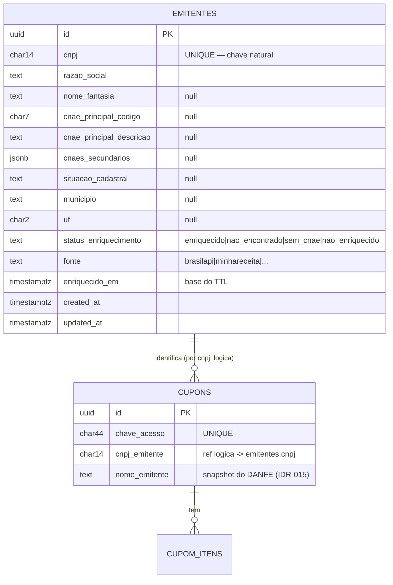

# ADR-014 — Cache de CNPJ (tabela `emitentes`, TTL parametrizável)

> Tipo: **Persistência**. Diagrama de dados. Herda o gate datastore-first (princípio #3).

## Contexto

O EPIC-009 exige **cachear** o CNPJ por **≥30 dias com TTL parametrizável** (default 30d, semeado; a
tela chega no EPIC-012), com a métrica "para CNPJs já vistos dentro do TTL, **zero chamadas à API
externa**". Falta decidir **onde o cache vive**, como o TTL é parametrizado, como invalida e o que
acontece no vencimento.

Duas restrições moldam a decisão. **Primeira**, o princípio #3 (datastore-first): antes de qualquer
store extra (cache Redis, etc.), provar que o Postgres não basta — e aqui o volume é ~2 CNPJs distintos
hoje, com dado que muda **mensalmente** (o dump da RFB). **Segunda**, um débito de modelagem existente:
hoje os dados do emitente (`nome_emitente`, `endereco_emitente`, `municipio_emitente`, `uf_emitente`)
são **colunas repetidas em cada `cupons`** (IDR-015), preenchidas pelo parse do DANFE. Isso funcionava
para o nome, mas não modela um **emitente** como entidade — e o CNAE (novo) é um dado **por CNPJ**, não
por cupom. Cachear CNAE como coluna de cupom seria duplicá-lo em cada cupom do mesmo emitente e não
teria noção de TTL.

Esta ADR decide a persistência do enriquecimento (ADR-012) de forma que o **cache** e o **registro
canônico do emitente** sejam a mesma coisa, no datastore primário.

## Forças (drivers) da decisão

- **F1 — Datastore-first (#3):** provar que o Postgres basta antes de qualquer cache dedicado. **Peso: alto.**
- **F2 — TTL parametrizável (default 30d), zero-chamada dentro do TTL:** requisito literal do épico e
  da métrica de eficiência. **Peso: alto.**
- **F3 — Emitente como entidade, não coluna de cupom:** CNAE é por CNPJ; cachear por cupom duplica e
  não expira. **Peso: alto.**
- **F4 — Persistência durável e auditável:** o dado enriquecido é insumo do motor de pontos e do
  Backoffice; precisa sobreviver a restart e ser inspecionável (não pode ser cache volátil). **Peso: alto.**
- **F5 — Nunca travar / stale-tolerante:** no vencimento, servir o dado velho e re-buscar em background
  é melhor que bloquear (cruza F3 da ADR-012). **Peso: médio.**
- **F6 — Config versionada e prospectiva (PDR-004 regra 4):** o TTL é um parâmetro que muda só dali pra
  frente, com histórico — mesmo contrato do EPIC-012. **Peso: médio.**

## Opções consideradas

### Opção A — Tabela `emitentes` no Postgres (chave natural CNPJ) = cache **e** registro canônico
- **Resumo:** um agregado **`Emitente`** (`app/Domain/Enriquecimento`) numa tabela `emitentes` com
  **`cnpj` como chave natural única**, guardando os campos do DTO `EmitenteEnriquecido` (ADR-012) +
  metadados de cache: `enriquecido_em`, `fonte` (brasilapi/minhareceita/…), `status_enriquecimento`
  (`enriquecido`/`nao_encontrado`/`sem_cnae`/`nao_enriquecido`). A leitura é **cache-first**: o
  enriquecedor (ADR-013) consulta `emitentes`; se existe e `enriquecido_em >= agora - TTL`, **não bate
  na API** (métrica de eficiência atendida). O **TTL é config** (`config/enriquecimento.php` →
  `ttl_dias`, default 30, semeado; sobrescrito por parâmetro versionado do EPIC-012). Cupom passa a
  referenciar o emitente **pelo CNPJ** (relação lógica, sem quebrar ADR-001/006). O `nome_emitente`
  parseado do DANFE (IDR-015) **permanece no cupom** como *snapshot do que a nota mostrou* (pode diferir
  da razão social oficial — nome fantasia); a razão social/CNAE oficiais vêm de `emitentes`.
- **Como atende aos princípios:**
  - ✅ Datastore-first: o "cache" é uma tabela do Postgres — **zero store extra**; é o uso pleno do #3.
  - ✅ Simplicidade: uma tabela, chave natural, TTL por comparação de timestamp.
  - ✅ Coesão: modela o emitente como entidade (corrige o débito das colunas-por-cupom do IDR-015 para o
    dado enriquecido).
  - ✅ Durável/auditável: sobrevive a restart; inspecionável no Backoffice (STORY-041).
  - ✅ Reversibilidade: se algum dia precisar de leitura ultra-quente, um cache volátil na frente é
    aditivo (ADR própria, com número).
- **Prós concretos:** atende a métrica "zero chamada dentro do TTL" trivialmente; vira a fonte única do
  emitente para motor (ADR-015) e Backoffice; TTL parametrizável com histórico via config versionada.
- **Contras concretos:** uma tabela e uma relação lógica novas; precisa de política de vencimento
  (resolvida com stale-while-revalidate).

### Opção B — Laravel Cache (store `database` ou Redis) com TTL nativo
- **Resumo:** `Cache::remember("cnpj:{$cnpj}", ttl, fn)` no store `database` (já default) ou Redis.
- **Como atende aos princípios:** ⚠️ o store `database` é Postgres (ok com #3), mas trata o dado como
  **par chave-valor volátil**, não como entidade — o Backoffice não consulta cache K/V, o motor não faz
  join, e o dado "some" no fim do TTL em vez de virar stale re-buscável.
- **Prós:** TTL nativo, menos código.
- **Contras:** perde F3 (emitente como entidade), F4 (auditabilidade/consulta), F5 (stale-while-
  revalidate). Redis ainda violaria #3 (store extra sem número). Descartada.

### Opção C — Status quo: cachear CNAE como colunas em `cupons` (estender IDR-015)
- **Resumo:** adicionar `cnae_emitente` etc. em `cupons`, preenchido na extração.
- **Contras:** duplica o CNAE em cada cupom do mesmo CNPJ; **sem noção de TTL** (cada cupom "cacheia"
  isolado); re-consulta a cada cupom novo do mesmo emitente (fere a métrica de eficiência). Descartada.

## Matriz comparativa

| Critério (força) | Peso | A (tabela emitentes) | B (Laravel Cache) | C (colunas em cupom) |
|---|---|---|---|---|
| F1 — datastore-first | alto | ✅ tabela PG, zero extra | ⚠️ (Redis viola; DB ok) | ✅ |
| F2 — TTL param + zero-chamada | alto | ✅ timestamp vs TTL config | ✅ TTL nativo | ❌ sem TTL, re-consulta |
| F3 — emitente como entidade | alto | ✅ | ❌ K/V volátil | ❌ duplicado por cupom |
| F4 — durável/auditável | alto | ✅ inspecionável | ❌ | ⚠️ preso ao cupom |
| F5 — stale-while-revalidate | médio | ✅ | ❌ some no TTL | ❌ |
| F6 — config versionada (PDR-004) | médio | ✅ TTL param + histórico | ⚠️ | ❌ |

## Decisão proposta

> **Optamos pela Opção A.**

Introduzimos a tabela **`emitentes`** no Postgres, com **`cnpj` como chave natural**, que é
**simultaneamente o cache e o registro canônico** do emitente enriquecido. A leitura é **cache-first**:
o enriquecedor (ADR-013) só bate na API pública (ADR-012) em **cache-miss** ou registro **vencido**
(`enriquecido_em < agora − TTL`). O **TTL é parâmetro** (`ttl_dias`, default **30**, semeado como
config; sobrescrito por parâmetro versionado do EPIC-012, PDR-004 regra 4). No vencimento aplicamos
**stale-while-revalidate**: servimos o dado velho e **enfileiramos** o refresh — nunca bloqueamos. O
`nome_emitente` do DANFE (IDR-015) permanece no cupom como snapshot da nota; razão social/CNAE oficiais
passam a viver em `emitentes`.

### Modelo de dados

- **Relação lógica por CNPJ** (não FK dura), coerente com ADR-001 (chave natural) e ADR-006 (bases
  segregadas). Um cupom sem emitente ainda enriquecido lê o CNPJ da chave e degrada na UI (IDR-015).
- **TTL:** `enriquecido_em >= agora − ttl_dias` ⇒ cache-hit (zero API). Config semeada; histórico de
  mudança do parâmetro é do modelo de config versionada da ADR-015 (§config), consumido pelo EPIC-012.
- **Invalidação:** por TTL (automática). **Force-refresh manual** no Backoffice (evolução, EPIC-012) —
  zera `enriquecido_em`, disparando re-busca no próximo uso.
- **Migração do débito IDR-015:** sem backfill obrigatório; `emitentes` nasce vazia e popula na demanda
  (lazy). Colunas de endereço em `cupons` seguem como snapshot; consolidação total é dívida opcional.

## Justificativa

A Opção A é o princípio #3 aplicado com honestidade: o cache **é** o datastore primário — uma tabela,
não um store novo. Ela resolve a métrica de eficiência ("zero chamada dentro do TTL") com um `WHERE`
sobre timestamp, e de quebra corrige a modelagem (emitente vira entidade, não coluna repetida por
cupom), servindo motor de pontos e Backoffice pela mesma fonte. O Laravel Cache (B) trataria dado de
domínio durável como K/V volátil e perderia auditabilidade e stale-while-revalidate; as colunas por
cupom (C) não têm TTL e ferem justamente a métrica de eficiência. O custo — uma tabela e uma relação
lógica — é barato e reversível (um cache quente na frente é aditivo, se algum número um dia pedir).

## Consequências

### Positivas (o que ganhamos)
- Métrica "zero chamada dentro do TTL" atendida por construção; cache-hit ratio observável (EPIC-009).
- Emitente vira entidade canônica: motor (ADR-015) e Backoffice (STORY-041) leem de um lugar só.
- TTL parametrizável com histórico, pronto para a tela do EPIC-012; nenhuma infra nova.

### Negativas / trade-offs aceitos
- Uma tabela + relação lógica novas; política de vencimento (stale-while-revalidate) a implementar.
- Débito do IDR-015 (endereço como coluna de cupom) fica parcialmente convivendo com `emitentes` —
  consolidação total é dívida opcional, não bloqueio.

### Neutras
- Emitente pode estar `nao_enriquecido` transitoriamente (cache-miss em falha da API — ADR-012); o
  motor pontua sem CNAE e a UI degrada (IDR-015). Re-pontuação após enriquecimento tardio é decisão de
  produto (não exigida agora).

### Para o time
- **Impacto em estórias:** STORY-040 cria `emitentes` + leitura cache-first + TTL config; STORY-041
  exibe o emitente no Backoffice; EPIC-012 expõe o TTL na tela.
- **ADRs relacionados:** ADR-012 (DTO que preenche), ADR-013 (quem escreve, em fila), ADR-015 (quem lê),
  ADR-001/006 (chave natural, bases segregadas), IDR-015 (snapshot do nome no cupom).
- **Necessidade de spike:** não.

## Plano de verificação

- **Como verificar conformidade:** teste prova cache-hit (segundo cupom do mesmo CNPJ dentro do TTL
  **não** chama a ACL — `EnriquecedorCnpj` fake com contador de chamadas), cache-miss (chama e persiste),
  vencimento (stale servido + refresh enfileirado), e TTL lido da config. Métrica de cache-hit exposta
  na observabilidade (IDR-006).
- **Sinais de revisão (quando reabrir):** se o cache-hit ratio cair e o volume de CNPJs distintos
  crescer a ponto de a leitura em `emitentes` pesar (número medido) → considerar índice/cache quente
  (ADR própria). Se o dado da RFB precisar de atualização mais fina que mensal → rever TTL default.
- **Spike de validação:** não.

---

## Aprovação humana

- **Status final:** ⬜ pendente | ✅ aceita | ❌ rejeitada | 🔄 superseded
- **Aprovado por:** <Alexandro>
- **Data:** —
- **Forma do aceite:** —
- **Condicionantes do aceite:** —

---

## Histórico

- 2026-07-06 — criada como `proposed` por Arquiteto (spike STORY-039 do EPIC-009).
