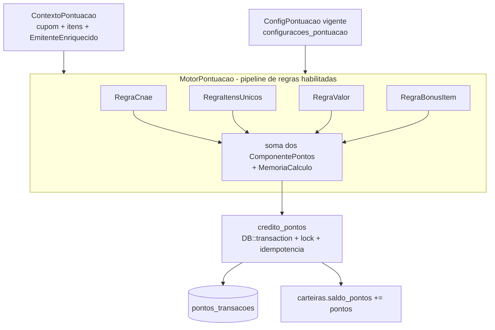

# ADR-015 — Motor de pontos, memória de cálculo, ledger imutável e config versionada

> Tipo: **Persistência + padrão de domínio**. Diagramas de agregado e de composição. Fundação dos
> EPIC-010 (motor), EPIC-011 (conversão/resgate/migração) e EPIC-012 (configuração).

## Contexto

O PDR-004 substitui o rate fixo por **pontos** calculados por um **motor de regras configurável** que
compõe, no mínimo: **CNAE** do emitente (ADR-012/014), **quantidade de itens únicos**, **valor** do
cupom e **itens com bônus** — e novas regras devem **entrar sem reescrever o motor**. Pontos convertem
em R$ só no **resgate manual com mínimo**, pela **taxa vigente no momento do resgate**. Parâmetros valem
**só dali pra frente** (mudança prospectiva, com histórico); pontos já creditados são **imutáveis**. A
tela de configuração (EPIC-012) administra tudo isso.

Já temos as peças-espelho no código: o ledger de cashback **`carteira_transacoes`** (append-only,
tipos `credito_cashback`/`debito_saque`/`estorno_saque`, **índice único parcial** por `cupom_id` para
idempotência), o `CreditarCashbackService` (crédito em `DB::transaction` + `lockForUpdate`, tudo em
inteiro de centavos via bcmath, sem float) e o padrão de crédito por evento enfileirado (IDR-008). O
motor de pontos é a **generalização** desse desenho: um ledger de **pontos**, um motor de **regras
compostas** e uma **configuração versionada**.

Esta ADR fixa quatro contratos que destravam três épicos: (1) a **abstração das regras** e como somam;
(2) a **memória de cálculo** que o extrato do Colaborador mostra (CA-3); (3) o **ledger imutável** de
pontos e a **transacionalidade do resgate** com a carteira (EPIC-011); (4) o **modelo de configuração
versionada prospectiva** (EPIC-012). **Valores** de parâmetros (pesos, taxa, mínimo) são de produto
(PO) — **fora do escopo** desta ADR (ver Fora de escopo).

## Forças (drivers) da decisão

- **F1 — Extensibilidade sem reescrita (PDR-004 regra 1, #5):** nova regra = nova classe; o motor não
  muda. **Peso: alto.**
- **F2 — Memória de cálculo auditável (CA-3):** cada crédito guarda **como** foi calculado, por regra —
  é o que o extrato mostra. **Peso: alto.**
- **F3 — Ledger imutável e idempotente (dinheiro):** append-only, sem duplicar, à prova de retry da fila
  (ADR-013). **Peso: alto.**
- **F4 — Config versionada prospectiva (PDR-004 regra 4):** parâmetros valem só pra frente, com
  histórico; o cálculo usa a config **vigente no processamento**; pontos creditados imutáveis. **Peso: alto.**
- **F5 — Transacionalidade do resgate (EPIC-011):** debitar pontos e creditar R$ na carteira é **uma**
  transação; taxa vigente no resgate; mínimo respeitado. **Peso: alto.**
- **F6 — Determinismo (premissa regulatória PDR-004):** zero aleatoriedade no ganho/conversão; mesmo
  cupom + mesma config ⇒ mesmos pontos. **Peso: alto.**
- **F7 — Consome o emitente enriquecido (CA-3):** o motor lê o DTO `EmitenteEnriquecido` (ADR-012/014) e
  **tolera** `nao_enriquecido` (pontua sem CNAE). **Peso: médio.**

## Opções consideradas

### Opção A — Motor "strategy + pipeline de regras" + ledger de pontos espelhando `carteira_transacoes` + config versionada por tabela
- **Resumo:**
  - **Regras:** interface `RegraPontuacao { id(): string; aplicar(ContextoPontuacao, ConfigPontuacao): ComponentePontos }`.
    O `MotorPontuacao` recebe as regras **habilitadas na config vigente**, roda cada uma sobre um
    `ContextoPontuacao` (cupom + itens + `EmitenteEnriquecido`) e **soma** os `ComponentePontos`.
    Regras concretas do PDR-004: `RegraCnae`, `RegraItensUnicos`, `RegraValor`, `RegraBonusItem`. Nova
    dimensão = nova classe registrada; motor intacto (F1). Sem estado, determinístico (F6).
  - **Memória de cálculo (CA-3):** cada `ComponentePontos` = `{regra_id, descricao, entrada, pontos}`;
    o crédito guarda a lista (`MemoriaCalculo`) em `jsonb` no ledger — é o contrato que o extrato lê
    (o que cada regra viu e quantos pontos rendeu).
  - **Ledger:** tabela **`pontos_transacoes`** append-only espelhando `carteira_transacoes`: tipos
    `credito_pontos` / `debito_resgate` / `estorno_resgate` / `migracao_saldo`; **índice único parcial**
    `(cupom_id) WHERE tipo='credito_pontos'` (idempotência por cupom, padrão IDR-008); `pontos` inteiro;
    `memoria_calculo jsonb`; `config_versao` (qual config gerou); FK lógica ao cupom. Saldo de pontos em
    **`carteiras.saldo_pontos`** (coluna nova, inteiro, CHECK ≥ 0), incrementado **na mesma transação**
    do insert do ledger, sob `lockForUpdate` (reusa o desenho do `CreditarCashbackService`).
  - **Config versionada (F4):** tabela **`configuracoes_pontuacao`** com `versao`, `vigente_a_partir_de`,
    `payload jsonb` (regras habilitadas + pesos + taxa de conversão + mínimo de resgate + TTL do cache),
    `criado_por`, `criado_em`. **Imutável** (append-only); a "vigente" é a de maior `vigente_a_partir_de`
    ≤ agora. O motor resolve a config vigente **no instante do processamento** e grava `config_versao`
    no crédito. Mudança de parâmetro = **nova versão**, nunca UPDATE — histórico (quem/quando/o quê)
    nativo. É este o modelo que o EPIC-012 administra.
  - **Resgate (F5, EPIC-011):** `ResgatarService` numa `DB::transaction`: valida saldo ≥ mínimo
    (config vigente), aplica a **taxa vigente no resgate** (pontos→R$, inteiro/bcmath, sem float),
    debita `debito_resgate` no `pontos_transacoes` + credita R$ na carteira (`carteira_transacoes`),
    tudo sob lock, idempotente por `resgate_id`. **Migração** do saldo legado (PDR-004 regra 3) é um
    lançamento `migracao_saldo` pela taxa inicial, auditável.
- **Como atende aos princípios:**
  - ✅ Simplicidade/coesão: reusa um padrão de ledger já em produção; regras isoladas e testáveis.
  - ✅ Datastore-first: três tabelas no Postgres; zero infra nova.
  - ✅ Reversibilidade: regra nova é aditiva; config nova é uma linha; nada retroage.
  - ✅ Determinismo/regulatório: sem aleatoriedade; auditoria por construção.
- **Prós concretos:** cada CA da estória vira um contrato concreto; extrato e Backoffice leem estruturas
  estáveis; idempotência e transacionalidade herdadas de código provado (IDR-008, CreditarCashback).
- **Contras concretos:** três tabelas + um jsonb de memória; disciplina para manter regras puras
  (sem I/O dentro de `aplicar`).

### Opção B — Motor com regras hard-coded numa função de cálculo (sem strategy)
- **Resumo:** uma função `calcularPontos(cupom)` com `if`s por dimensão.
- **Contras:** viola F1 — cada regra nova reescreve a função; testar uma dimensão isolada fica difícil;
  memória de cálculo vira efeito colateral em vez de saída estruturada. Descartada.

### Opção C — Regras como dados/DSL configurável (motor de regras genérico, ex.: expressões em jsonb)
- **Resumo:** regras expressas como dados interpretados (uma mini-DSL de condições/pesos).
- **Como atende aos princípios:** ⚠️ flexível, mas **complexidade imaginada** (princípio #1): hoje há 4
  dimensões conhecidas; um interpretador de DSL é motor de foguete para 4 regras. Risco de segurança
  (avaliar expressão de config) e de opacidade (memória de cálculo derivada de DSL).
- **Contras:** custo/superfície desproporcionais ao problema atual. **Fica como evolução** se o número
  de regras/variações explodir. Descartada por ora.

## Matriz comparativa

| Critério (força) | Peso | A (strategy + ledger espelho) | B (hard-coded) | C (DSL em dados) |
|---|---|---|---|---|
| F1 — extensível sem reescrita | alto | ✅ classe nova | ❌ reescreve função | ✅ (dado novo) |
| F2 — memória de cálculo | alto | ✅ saída estruturada | ⚠️ efeito colateral | ⚠️ derivada da DSL |
| F3 — ledger imutável/idempotente | alto | ✅ padrão provado | ✅ | ✅ |
| F4 — config versionada prospectiva | alto | ✅ tabela append-only | ⚠️ | ✅ |
| F5 — transacionalidade resgate | alto | ✅ DB::transaction+lock | ✅ | ✅ |
| F6 — determinismo/regulatório | alto | ✅ puro | ✅ | ⚠️ DSL audita pior |
| Simplicidade (#1) | alto | ✅ proporcional | ✅ | ❌ overkill agora |

## Decisão proposta

> **Optamos pela Opção A.**

O **motor de pontos** é um pipeline de **`RegraPontuacao`** (strategy): regras puras e determinísticas
(`RegraCnae`, `RegraItensUnicos`, `RegraValor`, `RegraBonusItem` no MVP) que o `MotorPontuacao` roda —
conforme habilitadas na **config vigente** — sobre um `ContextoPontuacao` (cupom + itens +
`EmitenteEnriquecido`), somando `ComponentePontos`. Cada crédito grava a **memória de cálculo**
(`jsonb`, lista `{regra_id, descricao, entrada, pontos}`) no **ledger `pontos_transacoes`**
(append-only, idempotente por cupom via índice único parcial, saldo em `carteiras.saldo_pontos`
incrementado na mesma transação sob lock — espelho do `carteira_transacoes`/`CreditarCashbackService`).
A **configuração** é **versionada e prospectiva** (`configuracoes_pontuacao`, append-only; vigente = a
de maior `vigente_a_partir_de ≤ agora`), com histórico nativo — administrada pelo EPIC-012. O
**resgate** (EPIC-011) debita pontos e credita R$ na carteira **numa única transação**, pela **taxa
vigente no resgate**, respeitando o mínimo, idempotente. **Valores** de pesos/taxa/mínimo são de
produto (PO).

### Contrato do emitente enriquecido consumido pelo motor (CA-3)

O motor consome do EPIC-009 **exatamente** o DTO `EmitenteEnriquecido` (ADR-012/014):
`{ cnpj, razao_social, cnae_principal_codigo, cnae_principal_descricao, cnaes_secundarios[],
situacao_cadastral, municipio, uf, status_enriquecimento }`. `RegraCnae` usa `cnae_principal_codigo`;
se `status_enriquecimento != enriquecido` (sem CNAE), a regra rende **0 pontos** e registra na memória
`{regra_id: cnae, entrada: "emitente nao enriquecido", pontos: 0}` — **o cupom pontua pelas demais
regras** (invariante do CA-4/ADR-012). Re-pontuação após enriquecimento tardio **não** é exigida
(decisão de produto se um dia for).

### Contrato da memória de cálculo (CA-3) — o que o extrato mostra

```json
{
  "config_versao": 7,
  "total_pontos": 42,
  "componentes": [
    {"regra_id": "cnae",         "descricao": "Supermercado (CNAE 4711-3/02)", "entrada": "4711302", "pontos": 20},
    {"regra_id": "itens_unicos", "descricao": "18 itens únicos",               "entrada": 18,         "pontos": 12},
    {"regra_id": "valor",        "descricao": "Cupom de R$ 235,43",            "entrada": "235.43",   "pontos": 8},
    {"regra_id": "bonus_item",   "descricao": "2 itens com bônus",             "entrada": 2,          "pontos": 2}
  ]
}
```

O extrato do Colaborador renderiza `componentes` por crédito; o Backoffice audita `config_versao`.

### Modelo de dados

```mermaid
erDiagram
  CARTEIRAS ||--o{ CARTEIRA_TRANSACOES : "ledger R$ (existente)"
  CARTEIRAS ||--o{ PONTOS_TRANSACOES : "ledger de pontos (novo)"
  CONFIGURACOES_PONTUACAO ||..o{ PONTOS_TRANSACOES : "config_versao usada"
  CARTEIRAS {
    uuid   id PK
    uuid   user_id UNIQUE
    bigint saldo_centavos "R$ (existente)"
    bigint saldo_pontos "NOVO, CHECK >= 0"
  }
  PONTOS_TRANSACOES {
    uuid   id PK
    uuid   carteira_id FK
    text   tipo "credito_pontos|debito_resgate|estorno_resgate|migracao_saldo"
    bigint pontos
    uuid   cupom_id "null; UNIQUE parcial WHERE tipo=credito_pontos"
    uuid   resgate_id "null; idempotencia do resgate"
    int    config_versao
    jsonb  memoria_calculo "null exceto credito_pontos"
    timestamptz created_at
  }
  CONFIGURACOES_PONTUACAO {
    uuid   id PK
    int    versao "sequencial"
    timestamptz vigente_a_partir_de
    jsonb  payload "regras habilitadas, pesos, taxa, minimo, ttl_cache"
    text   criado_por
    timestamptz criado_em
  }
```

### Composição do motor



## Justificativa

A Opção A é a generalização direta de código **já provado** no projeto (o ledger de cashback, o crédito
idempotente sob lock, o crédito por evento enfileirado do IDR-008), aplicada aos quatro contratos que a
estória pede. O strategy de regras entrega F1 (regra nova = classe nova) e F2 (memória de cálculo como
**saída estruturada**, não efeito colateral) sem inventar um interpretador de DSL (C) que seria
complexidade imaginada para 4 dimensões — princípio #1. A config append-only entrega F4 (prospectiva,
com histórico) com o mecanismo mais simples possível (uma linha nova por mudança), e a transação única
do resgate entrega F5 reusando o padrão `DB::transaction + lockForUpdate` do `CreditarCashbackService`.
Determinismo (F6) cai naturalmente de regras puras — o que sustenta a premissa regulatória do PDR-004.

## Consequências

### Positivas (o que ganhamos)
- Motor extensível, memória de cálculo auditável, ledger imutável e config versionada — os quatro
  contratos que EPIC-010/011/012 consomem, definidos de uma vez (coerência entre épicos).
- Idempotência e transacionalidade herdadas de código em produção (baixo risco de bug de dinheiro).
- Determinismo sustenta a tese regulatória (sem aleatoriedade no ganho/conversão).

### Negativas / trade-offs aceitos
- Três tabelas novas (`pontos_transacoes`, `configuracoes_pontuacao`, coluna `saldo_pontos`) + `jsonb`
  de memória. Disciplina para manter regras puras (sem I/O em `aplicar`).
- Duas moedas coexistem no ledger durante a virada (R$ legado + pontos) — o corte é EPIC-011.

### Neutras
- A coexistência cashback→pontos e o desligamento do `CreditarCashbackAoValidar` são de EPIC-010/011;
  esta ADR só garante que os ledgers convivem e que a migração é um lançamento auditável.

### Para o time
- **Impacto em estórias:** EPIC-010 implementa motor + regras + `pontos_transacoes` + `PontuarCupom`
  (listener da ADR-013); EPIC-011 implementa resgate + migração; EPIC-012 implementa a tela sobre
  `configuracoes_pontuacao`.
- **ADRs relacionados:** ADR-012/014 (emitente enriquecido que a `RegraCnae` consome), ADR-013 (motor
  roda em fila via `PontuarCupom`), ADR-005/006 (carteira e bases segregadas), IDR-008 (crédito por
  evento idempotente).
- **Necessidade de spike:** não — o padrão base já existe; o risco externo (API) foi o que este spike
  de-riscou.

## Plano de verificação

- **Como verificar conformidade:** testes unitários por regra (pura, determinística: mesmo contexto ⇒
  mesmos pontos + memória); teste do motor somando componentes com uma config fixa; teste de
  idempotência do crédito (retry não duplica — índice único parcial); teste do resgate
  (saldo ≥ mínimo, taxa vigente, débito+crédito na mesma transação, idempotente por `resgate_id`);
  teste de config prospectiva (crédito usa a versão vigente no processamento; mudança não retroage).
- **Sinais de revisão (quando reabrir):** se o nº de regras/variações crescer a ponto de justificar
  regras-como-dado (Opção C) → ADR de evolução; se surgir demanda de re-pontuação retroativa → decisão
  de produto (PO) + ADR de dados; se qualquer regra introduzir aleatoriedade → **parar** (premissa
  regulatória PDR-004).
- **Spike de validação:** não.

## Fora de escopo (reafirmado)

- **Valores** de pesos por regra, taxa de conversão pontos→R$, mínimo de resgate, TTL default — são de
  **produto (PO)**. Esta ADR define a **estrutura** que os hospeda (config versionada), não os números.
- Telas (EPIC-012), migração de dados concreta (EPIC-011), código de produção.

---

## Aprovação humana

- **Status final:** ✅ aceita
- **Aprovado por:** Alexandro
- **Data:** 2026-07-06
- **Forma do aceite:** aprovação explícita em sessão de Cowork (papel Arquiteto), lote STORY-039 ("ADRs aprovadas").
- **Condicionantes do aceite:** nenhuma.

---

## Histórico

- 2026-07-06 — criada como `proposed` por Arquiteto (spike STORY-039 do EPIC-009).
- 2026-07-06 — **aceita** por Alexandro → `accepted`.
