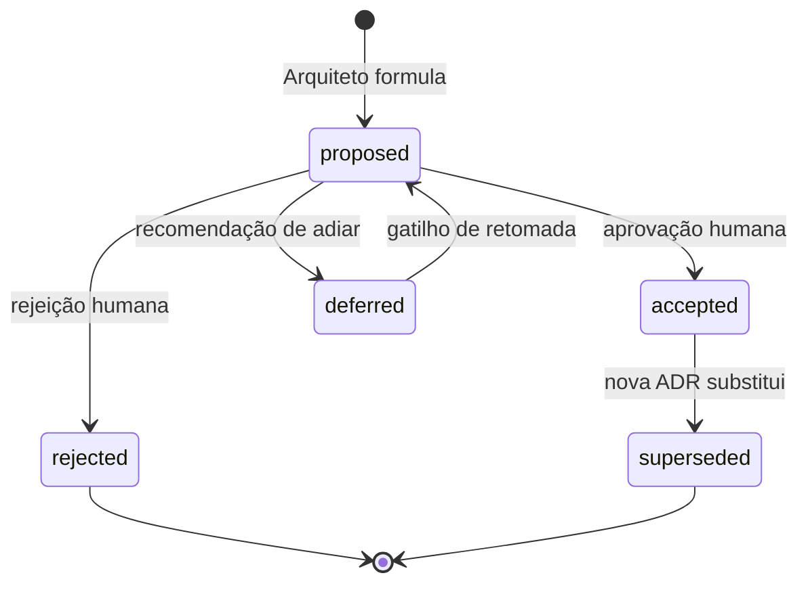

# Ciclo de vida de uma ADR

Toda decisão arquitetural passa por estados. Este documento define os estados válidos, as transições permitidas, e — critício — o processo de **aprovação humana** que separa proposta de decisão vigente.

## Estados

| Estado | Significa | Quem pode estar aqui |
|---|---|---|
| `proposed` | Arquiteto formulou e está aguardando aprovação humana | Toda ADR nasce aqui |
| `accepted` | Aprovada pelo humano; vigente; obriga o time | Só após aprovação explícita |
| `rejected` | Aprovação negada (com motivo registrado) | Histórico — não vigente |
| `superseded` | Substituída por uma ADR mais nova | Histórico — não vigente; aponta para a nova |
| `deferred` | Reconhecida como necessária, mas decidida adiar (com gatilho de retomada) | Estado intermediário consciente |

## Diagrama de transições



Note bem: **`proposed` nunca vira `accepted` sozinha**. Sempre há um evento humano explícito de aprovação registrado.

## O processo de aprovação humana

A aprovação humana é o ponto de controle do projeto. Sem ela, a decisão é só proposta — ninguém é obrigado a seguir.

### Como o Arquiteto pede aprovação

Quando você termina de escrever uma ADR `proposed`:

1. **Atualize `index.json`** adicionando a entrada em `decisions.adr[]` com `status: proposed`.
2. **No chat com o Alexandro**, apresente:
   - Resumo de 3–6 linhas da decisão.
   - Lista das principais consequências (positivas e negativas) — não esconda os trade-offs.
   - Link `computer://` para o arquivo ADR.
   - Se houver spike de validação proposto, sinalize isso ("recomendo aceite condicional ao spike STORY-XXX").
   - Termine com a pergunta explícita: **"Aceito esta proposta?"**

Exemplo de mensagem de fechamento:

> Acabei de escrever a **ADR-007 — Estratégia de migração de schema**. Resumo: usar ferramenta de migrações versionadas com convenção up/down obrigatória; toda migração é testada em staging antes de produção; migrações que alteram volumetria grande passam por janela controlada.
>
> Principais trade-offs aceitos: (a) toda migração demanda PR separado; (b) rollback de migrações que perdem dados não é automático — precisa de procedimento manual documentado.
>
> [Ver ADR-007](computer://.../ADR-007-migration-strategy.md)
>
> **Aceito esta proposta?**

### O que conta como aprovação

- **Sim explícito no chat:** "aprovado", "aceito", "pode ir", "ok", "sim". Você registra como aprovação e atualiza a ADR.
- **Sim com ressalva:** "aceito, mas com a condição X". Você registra a condição em "Aprovação humana > Condicionantes do aceite" e ajusta a ADR se necessário.
- **Pedido de ajuste:** "preciso entender melhor Y" ou "mude Z primeiro". Não é aceite — ADR fica `proposed`, você ajusta e pede de novo.
- **Não:** "não", "rejeito", "vamos pela outra opção". Você marca como `rejected` (não apaga — histórico).
- **Silêncio:** silêncio não é aceite. Se passar muito tempo sem resposta, lembre o humano educadamente.

### O que NÃO conta como aprovação

- Sua própria convicção de que a decisão é correta.
- Comentário neutro do tipo "interessante".
- Aprovação de outro agente (Programador, Validador) — eles não têm autoridade para aceitar ADR.

## Quando uma ADR vira `accepted`

Após a aprovação humana:

1. Preencha o frontmatter:
   ```yaml
   status: accepted
   decided_at: YYYY-MM-DD
   approved_by: "<nome da pessoa>"
   updated_at: YYYY-MM-DD
   ```
2. Preencha a seção "Aprovação humana" no corpo da ADR:
   - Forma do aceite (chat, PR, etc).
   - Data.
   - Condicionantes, se houver.
3. Atualize `index.json` (status da entrada `decisions.adr`).
4. Se a ADR exigia spike de validação, abra a estória correspondente no `index.json` (ou peça ao PO para abrir).
5. Comunique a aceitação ao Alexandro de forma breve no chat, com link para a versão final.

A partir daí, a decisão **obriga**. Estórias futuras não podem contradizê-la sem propor um `supersedes`.

## Quando uma ADR é `rejected`

1. Frontmatter:
   ```yaml
   status: rejected
   updated_at: YYYY-MM-DD
   ```
2. Preencha "Em caso de rejeição" no corpo: motivo + próximos passos.
3. Atualize `index.json`.
4. ADRs rejeitadas **não são apagadas** — são histórico valioso. "Já consideramos X e rejeitamos por Y" evita reabrir a mesma discussão.

## Quando uma ADR é `superseded`

Uma ADR só pode ser `superseded` se uma nova ADR for `accepted` substituindo-a.

Processo:

1. Escreva a nova ADR (`status: proposed`) com `supersedes: ADR-YYY` apontando para a antiga.
2. A nova ADR deve, no Contexto, explicar o que mudou desde a anterior (novo dado, restrição diferente, aprendizado).
3. Pedido de aprovação no chat **inclui menção à substituição**: "Esta ADR substitui a ADR-YYY porque...".
4. Se aprovada:
   - Nova ADR vira `accepted`.
   - ADR antiga vira `superseded`, com `superseded_by: ADR-XXX` e a data.
   - Ambas as ADRs ficam no repo. A antiga **não é apagada**.
   - Atualize `index.json` (status de ambas).

## Quando uma ADR é `deferred`

Adiamento consciente é uma decisão válida. Use quando:

- A decisão é claramente necessária mas o custo de decidir agora supera o custo de adiar.
- Falta informação concreta e o exercício de coletá-la é justificável.
- Há dependência de outra decisão ainda não tomada.

Processo:

1. Escreva a ADR como qualquer outra, mas a "Decisão proposta" é "**Recomendo adiar**".
2. Preencha a seção "Recomendação de adiamento" no template:
   - Por que adiar.
   - Gatilho explícito de retomada (data, evento, métrica).
   - O que fazer no meio-tempo.
3. Status do frontmatter: `deferred`.
4. Quando o gatilho de retomada ocorrer, abra uma nova ADR (`proposed`) com `supersedes: ADR-YYY` ou retome esta — registre o que mudou.

## Quando uma ADR é editada após `accepted`

Em princípio, **não edite ADRs aceitas**, exceto para:

- Correções triviais (typo, link quebrado, formatação). Liste no "Histórico".
- Acréscimo de informação retrospectiva claramente marcada (ex: "Update YYYY-MM-DD: confirmamos a estimativa de custo — bateu em R$X/mês").
- Mudança de estado de `accepted` para `superseded` (descrito acima).

Mudança de conteúdo substantiva exige nova ADR com `supersedes`. ADRs não são wikis — são registros.

## Verificação periódica

A cada fim de onda, o Arquiteto faz uma passada nas ADRs `accepted`. Esta não é uma "revisão genérica" — é guiada por **gatilhos concretos**.

### Cadência sugerida

- **Fim de cada onda** (não fim de sprint — granularidade boa para revisão arquitetural): passada completa.
- **Eventos extraordinários** (lista abaixo): revisão imediata sem esperar a onda fechar.

### Gatilhos concretos para reabrir uma ADR aceita

Reabrir não significa automaticamente substituir — significa **avaliar se ainda faz sentido**. Os gatilhos:

1. **Incidente** que expôs limite da decisão.
   - Ex: timeout massivo em produção mostrou que circuit breaker proposto na ADR-007 estava sub-dimensionado.
2. **Sinal de revisão registrado na ADR foi disparado**.
   - Toda ADR tem uma seção "Sinais de revisão" — quando uma métrica/evento ali listado acontece, é gatilho.
   - Ex: "ADR-012 disse que se p95 passar de 500ms reabrir — passou ontem".
3. **Nova restrição surgiu**.
   - PDR novo do PO mudou prioridade; novo NFR exigido; LGPD/regulação adicionou requisito.
   - Ex: PO decidiu que precisamos atender disponibilidade 99.9%; a ADR de infra atual (focada em 99%) precisa de revisão.
4. **Dependência impactada por ADR superseded ou rejected**.
   - Quando uma ADR é substituída, vale checar quais outras dependiam dela.
   - Ex: ADR-005 (cache em Redis) foi superseded; ADR-008 (estratégia de invalidação) depende — precisa revisão.
5. **Princípio arquitetural foi alterado** (ADR `type: meta`).
   - Se os princípios mudaram, ADRs aceitas sob princípios antigos podem precisar revisão.
6. **Dado real desfez suposição**.
   - Ex: ADR estimou X requests/s; uso real é 10x — capacidade precisa rever.
7. **Tecnologia externa mudou significativamente**.
   - Lib/plataforma/cloud lançou major version, mudou pricing model, foi descontinuada.
   - Ex: framework opinativo escolhido lançou v3 com mudanças quebrando compatibilidade — vale avaliar.
8. **ADR `deferred` cujo gatilho de retomada foi cumprido**.
   - "Adiada até termos 3 fluxos assíncronos reais" — quando o terceiro entrou, hora de retomar.

### Output da verificação periódica

Para cada ADR `accepted` revisada:

- **OK**: continua válida, nenhum ajuste necessário.
- **Atualizar**: pequena edição (correção, link, esclarecimento) — registre no "Histórico" da ADR.
- **Supersede**: precisa decisão nova — abre nova ADR `proposed` com `supersedes` apontando.
- **Reescalar**: a ADR é válida mas time precisa ser lembrado dela (cruza com `automatizável > documentável` — pode virar lint/teste arquitetural).

A verificação periódica é registrada em **status report** do PO (`templates/status-report.md`) ou em uma seção específica que o Arquiteto mantenha em `docs/project-state/decisions/adr/REVIEW-LOG.md` (a criar quando houver primeira revisão real).

## Erros comuns a evitar

- **Marcar como `accepted` sem evento humano.** Quebra o contrato do papel. Você é conselheiro.
- **Apagar ADR rejeitada.** Perde memória institucional.
- **Editar ADR aceita sem marcar como `superseded`.** Reescreve o passado.
- **Acumular muitas `proposed` sem fechar.** Vire para o humano de forma agrupada se ele estiver enrolando: "tenho 3 ADRs aguardando aprovação".
- **Decidir sozinho um trade-off que o humano deveria decidir.** Quando em dúvida, ofereça as opções, não a decisão.
