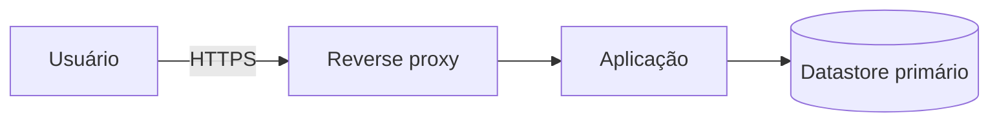

# ADR-XXX — <título>

## Contexto

<2–4 parágrafos. Qual é a situação? Que forças/restrições estão em jogo? Por que precisamos decidir agora? Inclua restrições funcionais (referência aos arquivos relevantes em `docs/especificacao/` — `glossary.md`, `business-rules.md`, `domain/<agregado>.md`, `flows/`), não-funcionais (`docs/especificacao/non-functional.md`), PDRs aplicáveis (`docs/project-state/decisions/pdr/`), de time (tamanho, skill), de orçamento, e de prazo. Não proponha solução ainda.>

## Forças (drivers) da decisão

> Liste os fatores que mais pesam. Eles viram critérios na matriz comparativa.

- **F1 — <nome curto>:** <descrição> (ex: "tempo até primeira release em produção: meta 6 semanas")
- **F2 — ...:** ...
- **F3 — ...:** ...

## Opções consideradas

### Opção A — <nome curto>
- **Resumo:** <1 parágrafo do que é essa opção>
- **Como atende aos princípios** (`references/architecture-principles.md`):
  - ✅ Simplicidade: ...
  - ⚠️ Reversibilidade: ...
  - ❌ Custo: ...
- **Prós concretos:** ...
- **Contras concretos:** ...

### Opção B — <nome curto>
- **Resumo:** ...
- **Como atende aos princípios:** ...
- **Prós:** ...
- **Contras:** ...

### Opção C — Status quo / não decidir agora
- **Consequência se mantivermos:** <o que acontece se não decidirmos>
- **Custo de adiar:** <quão caro fica adiar>

> Pode adicionar Opção D, E etc se houver. Não force 3 opções se só há 2 viáveis.

## Matriz comparativa

| Critério (força) | Peso | Opção A | Opção B | Opção C (status quo) |
|---|---|---|---|---|
| F1 — <nome> | alto/médio/baixo | nota + nota curta | ... | ... |
| F2 — <nome> | ... | ... | ... | ... |
| F3 — <nome> | ... | ... | ... | ... |

> Use notas qualitativas (ex: "✅ ótimo", "⚠️ aceitável", "❌ ruim") ou numéricas (1–5). Importante é ser comparável, não pseudo-científico.

**Quando a decisão é claramente óbvia** (uma única opção razoável, sem comparação significativa a fazer): substitua esta matriz por **uma frase explicando por que era óbvia** e quais alternativas teóricas foram descartadas sem análise pesada. Forçar matriz para o óbvio vira teatro — e honestidade > teatro. Exemplo:

> "Decisão óbvia: OpenAPI é o padrão de fato para documentar APIs REST e é gerado nativamente pelo framework escolhido. Alternativas teóricas (escrever doc à mão, AsyncAPI, GraphQL schema): não se aplicam ao caso ou exigiriam abandonar o framework opinativo escolhido (princípio #4)."

A regra: se você consegue **defender em uma frase** por que a decisão era óbvia, faça isso. Se precisa de mais palavras, provavelmente não era tão óbvia e a matriz vale.

## Decisão proposta

> **Optamos pela Opção <X>.**

<1 parágrafo descrevendo a decisão em prosa, em modo afirmativo.>

## Justificativa

<Por que esta opção venceu? Conecte com as forças e princípios. Reconheça honestamente os trade-offs.>

## Diagrama (se aplicável)

> Inclua diagrama Mermaid quando a decisão envolver topologia, fluxo, ou estrutura macro de dados. Veja `references/diagrams.md` para tipos recomendados.

(Se não há diagrama útil, remova esta seção inteira em vez de deixar um placeholder vazio.)

## Consequências

### Positivas (o que ganhamos)
- ...
- ...

### Negativas / trade-offs aceitos
- ...
- ...

### Neutras (mudanças que não são bem boas nem ruins, mas precisam ser notadas)
- ...

### Para o time
- **Impacto em estórias existentes:** <quais>
- **ADRs/PDRs relacionados que esta decisão limita ou destrava:** <quais>
- **Necessidade de spike de validação:** sim/não, e por quê

## Plano de verificação

> Como saberemos depois que esta decisão está sendo respeitada e que continua sendo a certa? Sem isso, decisão arquitetural vira ficção. Pode ser informal — mas não pode estar vazio.

- **Como verificar conformidade:** <ex: "lint que verifica que módulo X não importa de módulo Y">
- **Sinais de revisão (quando reabrir esta decisão):** <ex: "se p95 de latência ultrapassar 500ms, reabrir">
- **Spike de validação proposto:** <ex: "STORY-XXX-spike-hello-world-stack — destrava o aceite">

## Recomendação de adiamento (apenas se status `deferred`)

> Use esta seção SÓ se a recomendação é não decidir agora.

- **Por que adiar:** <razão>
- **Gatilho de retomada:** <quando voltar a esta decisão>
- **O que mudar enquanto isso:** <ações no curto prazo apesar do adiamento>

---

## Aprovação humana

> Esta seção é o registro formal do aceite. Não preencha sozinho — preencha quando o humano aprovar no chat ou via PR.

- **Status final:** ⬜ pendente | ✅ aceita | ❌ rejeitada | 🔄 superseded
- **Aprovado por:** <nome — ex: Alexandro>
- **Data:** YYYY-MM-DD
- **Forma do aceite:** <ex: "aprovado em chat (sessão de YYYY-MM-DD)" | "PR #N mergeado" | "ata da reunião X">
- **Condicionantes do aceite:** <se a aprovação veio com ajustes/condições, liste aqui>

### Em caso de rejeição
- **Motivo:** ...
- **Próximos passos sugeridos:** <ex: "abrir nova ADR com Opção B" | "retomar quando tivermos dado Y">

### Em caso de superseding
- **Substituída por:** ADR-YYY
- **Razão da substituição:** ...

---

## Histórico

- YYYY-MM-DD — criada como `proposed` por Arquiteto
- YYYY-MM-DD — <mudança>
